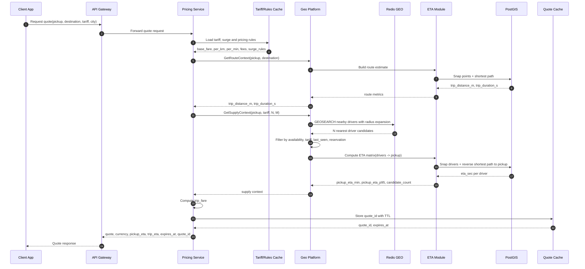
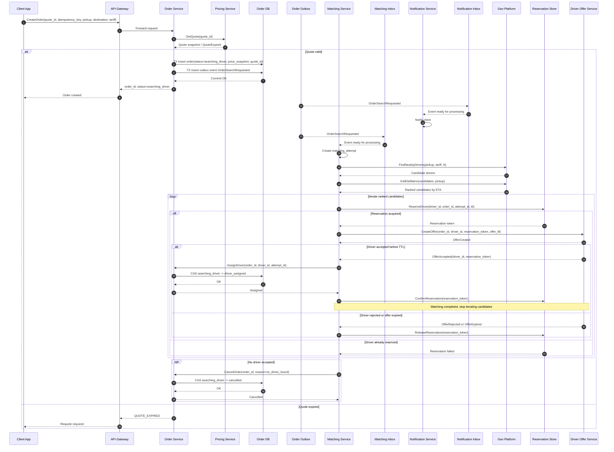
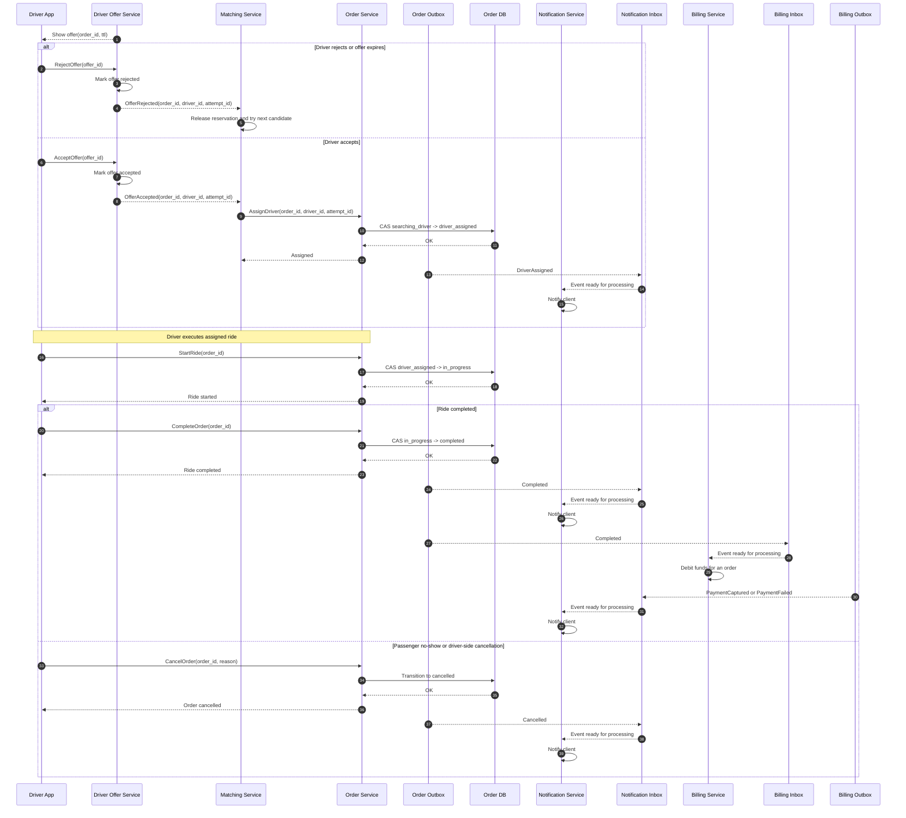
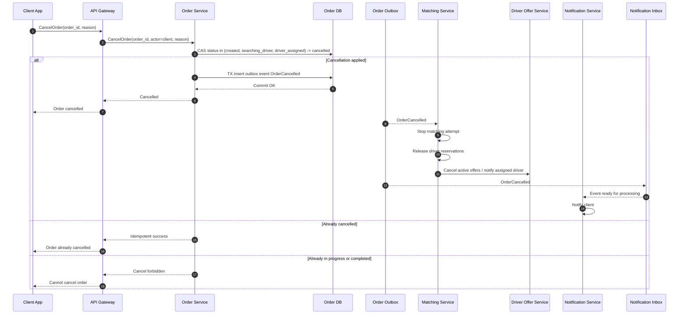
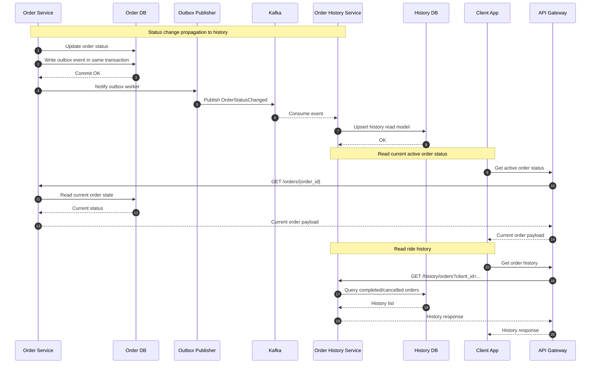
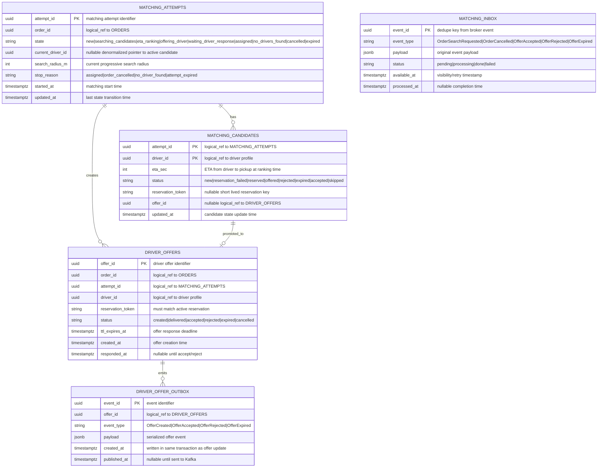
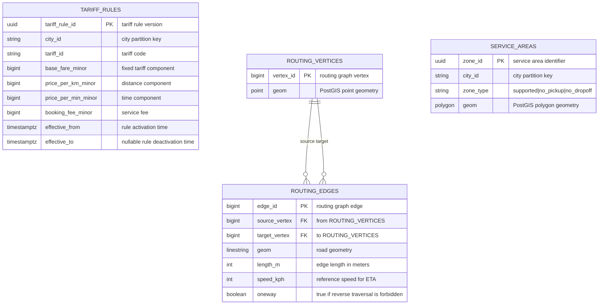
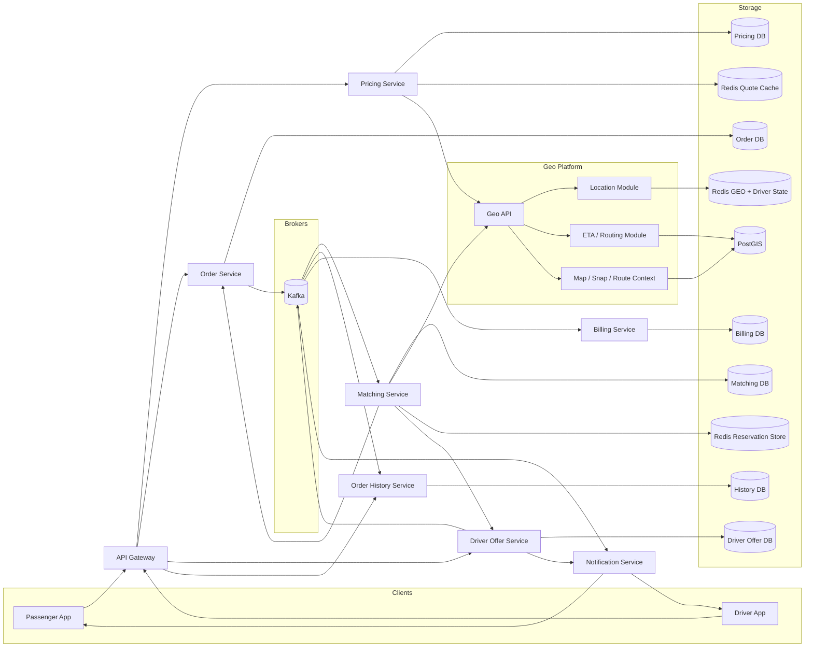

# Техническое решение проекта «Сервис заказа такси»

## Введение
- **Цель проекта:**  
Необходимо спроектировать сервис заказа такси, который позволяет пассажиру создать заказ на поездку, подобрать водителя и отслеживать основные статусы заказа до завершения или отмены.
Система должна поддерживать базовый сценарий:
пассажир указывает точку подачи и точку назначения;
система создаёт заказ;
система подбирает подходящего водителя;
водитель принимает заказ;
пассажир видит основные изменения статуса;
поездка завершается или отменяется.
Цель проекта — предложить архитектуру highload-системы, способной обрабатывать большое количество одновременно активных заказов и быстро выполнять подбор водителя.


---

## Глоссарий
| Термин        | Определение |
|---------------|-------------|
| Заказ  | заявка пассажира на поездку |
| Пассажир | пользователь, создающий заказ |
| Водитель | пользователь системы, принимающий и выполняющий заказ |
| Matching | процесс подбора водителя для заказа |
| ETA | ожидаемое время прибытия водителя |
| Idempotency | возможность безопасно повторить запрос без создания дубликатов |
| Статус заказа | текущее состояние поездки |

---

## Функциональные требования
Система должна предоставлять следующие функции:

### Создание заказа

Система должна позволять пассажиру:
- указать точку подачи;
- указать точку назначения;
- создать заказ;
- получить предварительную оценку стоимости.

Каждый заказ должен содержать как минимум:
- order_id;
- passenger_id;
- координаты точки подачи;
- координаты точки назначения;
- время создания;
- текущий статус заказа.

### Управление статусами заказа

Система должна поддерживать как минимум следующие статусы:
- created;
- searching_driver;
- driver_assigned;
- in_progress;
- completed;
- cancelled.

### Подбор водителя

Система должна:
- находить подходящего свободного водителя поблизости;
- назначать заказ только одному водителю;
- предотвращать ситуацию, при которой один заказ одновременно назначается нескольким водителям.

### Действия водителя

Система должна позволять водителю:
- получить предложение о заказе;
- принять заказ;
- отклонить заказ.

Если водитель не принял заказ, система должна продолжить поиск другого кандидата.

### Отмена заказа

Система должна поддерживать отмену заказа:
- пассажиром;
- водителем;
- системой, если водитель не найден за допустимое время.

### История поездок

Система должна позволять пассажиру:
- просматривать список завершённых и отменённых поездок;
- получать базовую информацию о заказе: время, маршрут, статус, стоимость.

---

## Нефункциональные требования

### Нагрузка

Система должна выдерживать:
- до 2 000 новых заказов в секунду в пике;
- до 10 000 запросов в секунду на чтение и обновление активных заказов.

### Производительность

Требования к производительности:
- создание заказа — P95 не более 200 мс;
- получение ответа о назначении водителя — в типовом случае не более 10 секунд;
- чтение текущего состояния активного заказа — P95 не более 100–200 мс.

### Надёжность

Система должна обеспечивать:
- отсутствие потери активных заказов;
- корректную обработку повторных пользовательских запросов;
- устойчивость к сбоям отдельных экземпляров сервисов.

### Консистентность

Для критичных операций требуется согласованность:
- один заказ не может быть назначен нескольким водителям;
- один водитель не может одновременно выполнять несколько активных заказов.

Для истории поездок допускается eventual consistency.

### Масштабируемость

Система должна горизонтально масштабироваться по следующим контурам:
- создание и обработка заказов;
- подбор водителей;
- чтение активных заказов;
- хранение истории поездок.

---

## Пользовательские сценарии

### Получение предварительного рассчета стоимости поездки

**Алгоритм:**
1. Gateway принимает запрос и передает его в Pricing Service (/CalculateQuote).
2. Pricing Service валидирует запрос:
- координаты корректны
- точки в обслуживаемой зоне
- тариф доступен в этом городе
3. Pricing Service запрашивает у Geo Platform маршрутный контекст (grpc /GetRouteContext):
- snap pickup - находит, к какой дороге лучше привязать точку подачи
- snap destination - находит, к какой дороге лучше привязать точку назначения
- build route pickup -> destination
- trip_distance_m - дистанция маршрута в метрах
- trip_duration_s - время маршрута в секундах
4. Pricing Service запрашивает у Geo Platform supply context вокруг точки подачи (grpc /GetSupplyContext)
- через Redis GEO ищутся N ближайших водителей
- затем Geo Platform фильтрует: available, нужный тариф, свежий last_seen, не зарезервирован под другой matching
- для лучших M кандидатов ETA-модуль считает ETA(driver -> pickup) по дорожному графу
- Pricing Service получает агрегаты: candidate_count, pickup_eta_min, pickup_eta_p95
5. Pricing Service загружает тарифные правила из своей БД:
- base_fare
- price_per_km
- price_per_min
- booking_fee
6. Pricing Service считает базовую цену поездки:
- trip_fare = base_fare + trip_distance_km * price_per_km + trip_duration_min * price_per_min + booking_fee
7. Кеширование результата quote (редварительный расчет цены поездки) в Redis на 1 мин

Сиквенс-диаграмма:



### Создание заказа пользователем

**Алгоритм:**
1. Клиент отправляет CreateOrder(quote_id, idempotency_key, payment_method, pickup, destination, tariff) в Gateway.
2. Gateway проксирует запрос в Order Service.
3. Order Service валидирует idempotency_key.
4. Order Service запрашивает у Pricing Service GetQuote(quote_id):
- если quote найден и не истек, берем из него зафиксированные данные
- если quote истек, возвращаем QUOTE_EXPIRED
5. Order Service в одной транзакции делает:
- insert into orders(...), сохраняет price_snapshot, quote_id, pickup, destination, tariff
- ставит статус searching_driver
- пишет запись в order_outbox с событием OrderSearchRequested
6. Order Service отвечает клиенту: order_id, status=searching_driver
7. Outbox worker в Order Service читает OrderSearchRequested и публикует его в Matching Service и Notification Service
8. Notification Service получает событие OrderSearchRequested, сохраняет событие в свой inbox pgqueue идемпотентно по event_id и отправляет пассажиру “Ищем водителя”
9. Matching Service сохраняет событие в свой inbox pgqueue идемпотентно по event_id
10. Worker Matching Service создает matching_attempt и запускает state machine:
- SEARCHING_CANDIDATES
- ETA_RANKING
- OFFERING_DRIVER
- WAITING_DRIVER_RESPONSE
11. Matching Service вызывает Geo Platform:
- FindNearbyDrivers(pickup, tariff, N)
- GetEtaMatrix(candidates, pickup)
12. Matching Service ранжирует водителей по ETA, freshness координат и бизнес-правилам
13. Перед оффером сервис резервирует водителя
14. Matching Service создает offer в Driver Offer Service с TTL
15. Если водитель принял оффер:
- Matching Service вызывает AssignDriver(order_id, driver_id, matching_attempt_id) в Order Service
- Order Service атомарно делает переход searching_driver -> driver_assigned
- Order Service пишет outbox-событие DriverAssigned
- Notification Service отправляет пуш пассажиру
16. Если водитель отказался или TTL истек:
- Matching Service снимает reservation
- переходит к следующему кандидату
17. Если кандидаты закончились:
- Matching Service вызывает CancelOrder(order_id, reason=no_driver_found)
- Order Service атомарно делает переход searching_driver -> cancelled
- Notification Service отправляет пуш пассажиру

Сиквенс-диаграмма:



### Исполнение заказа водителем

**Алгоритм:**

1. Водитель получает оффер в Driver Offer Service
2. Если водитель отклоняет оффер или TTL истекает:
- Driver Offer Service фиксирует rejected/expired
- публикует событие в Matching Service
- Matching Service снимает reservation и идет к следующему кандидату
3. Если водитель принимает оффер:
- Driver Offer Service фиксирует accepted
- публикует событие в Matching Service
- Matching Service вызывает AssignDriver(order_id, driver_id, matching_attempt_id) в Order Service
- только после успешного AssignDriver заказ считается назначенным
- Order Service пишет outbox-событие DriverAssigned
- Notification Service отправляет пуш пассажиру
4. После driver_assigned водитель работает уже с заказом:
- StartRide(order_id) -> in_progress [Обновление статуса заказа через CAS для предотвращения гонок]
- Order Service -> Kafka: RideStarted
- Notification Service получает событие DriverAssigned и отправляет пуш пассажиру
- CompleteOrder(order_id) -> Completed -> Billing Service получает событие Completed, начинает финальный расчет и списание -> Notification Service получает событие Completed и отправляет “Поездка завершена”
- CancelOrder(order_id, reason) -> Cancelled -> Notification Service получает событие и уведомляет клиента и водителя об отмене заказа
5. Если пассажир не сел в машину
- водитель вызывает CancelOrder
- Order Service проверяет допустимость перехода из текущего статуса
- заказ уходит в Cancelled с cancel_reason = passenger_no_show
- Notification Service получает событие и уведомляет клиента и водителя об отмене заказа

Сиквенс-диаграмма:



### Отмена заказа клиентом

**Алгоритм:**
1. Клиент может вызвать CancelOrder только если заказ в одном из статусов:
- created
- searching_driver
- driver_assigned
2. Gateway проксирует запрос в Order Service
3. Order Service делает CAS-переход
- из created/searching_driver/driver_assigned
- в cancelled
- outbox-событие OrderCancelled
4. Order Service отвечает клиенту успешно, если:
- отмена применена сейчас
- или заказ уже был отменен этим же запросом ранее
То есть операция должна быть идемпотентной.
5. Подписчики обрабатывают OrderCancelled:
- Matching Service останавливает matching_attempt, снимает reservation, закрывает активные офферы
- Driver Dispatch Service убирает оффер с экрана водителя или сообщает, что заказ отменен
- если водитель уже был назначен, его состояние освобождается обратно в available
- Notification Service получает событие и уведомляет клиента и водителя об отмене заказа

Сиквенс-диаграмма:



### Просмотр состояния заказа

Алгоритм для активного заказа:
1. После CreateOrder клиент получает order_id.
2. Клиент открывает экран активного заказа.
3. Первичное состояние читает из Order Service, rps GetOrder
4. Дальше обновления статуса получает через: WebSocket с fallback на polling
5. Если заказ стал completed или cancelled, экран активного заказа закрывается, а запись позже появляется в Order History Service.

Активный экран = Order Service
Архив поездок = Order History Service

Сиквенс-диаграмма:



---

## Модель данных

Общие правила:
- связи между таблицами разных сервисов следует читать как `logical_ref`, а не как физические `FK`;
- все денежные значения хранятся в `minor units`;
- все критичные переходы статусов в `Order Service` и `Matching Service` выполняются через `CAS` / optimistic locking;
- `Redis` используется только для краткоживущего и high-frequency состояния, а `PostgreSQL` остается источником истины.

### Order Core

```mermaid
erDiagram
    ORDERS {
        uuid order_id PK "stable order identifier"
        uuid passenger_id "logical_ref to passenger profile"
        uuid driver_id "nullable until status=driver_assigned"
        string city_id "city partition key"
        string tariff_id "selected tariff at quote time"
        uuid quote_id "logical_ref to Redis quote cache entry"
        uuid payment_method_id "logical_ref to billing payment method"
        string status "created|searching_driver|driver_assigned|in_progress|completed|cancelled"
        decimal pickup_lat "raw pickup coordinate"
        decimal pickup_lon "raw pickup coordinate"
        decimal destination_lat "raw destination coordinate"
        decimal destination_lon "raw destination coordinate"
        bigint estimated_price_minor "price snapshot from quote"
        bigint final_price_minor "nullable until completion or charged cancellation"
        string currency "ISO-4217 code"
        string cancel_reason "nullable unless status=cancelled"
        bigint version "incremented on every CAS update"
        timestamptz created_at "order creation time"
        timestamptz updated_at "last mutation time"
    }

    DRIVER_ASSIGNMENTS {
        uuid driver_id PK "one active assignment per driver"
        uuid order_id UNIQUE "one active driver per order"
        string state "assigned|in_progress"
        timestamptz assigned_at "time of successful AssignDriver"
        timestamptz updated_at "last assignment state change"
    }

    IDEMPOTENCY_KEYS {
        string scope PK "create_order"
        string idempotency_key PK "client supplied dedupe key"
        uuid passenger_id PK "uniqueness scope for one passenger"
        uuid order_id "created order returned on retry"
        timestamptz created_at "first successful processing time"
    }

    ORDER_OUTBOX {
        uuid event_id PK "event identifier"
        uuid order_id "logical_ref to ORDERS"
        string event_type "OrderSearchRequested|DriverAssigned|RideStarted|RideCompleted|OrderCancelled"
        jsonb payload "serialized domain event"
        timestamptz created_at "written in same transaction as order change"
        timestamptz published_at "nullable until sent to Kafka"
    }

    ORDERS ||--o| DRIVER_ASSIGNMENTS : active_assignment
    ORDERS ||--o{ IDEMPOTENCY_KEYS : protects
    ORDERS ||--o{ ORDER_OUTBOX : emits
```

`orders.status`
- `created` — заказ создан, quote зафиксирован, matching еще не активирован или только запускается.
- `searching_driver` — идет подбор водителя.
- `driver_assigned` — водитель назначен, но поездка не началась.
- `in_progress` — пассажир в машине, поездка выполняется.
- `completed` — поездка успешно завершена.
- `cancelled` — заказ отменен пользователем, водителем или системой.

`driver_assignments.state`
- `assigned` — водитель назначен, но поездка еще не началась.
- `in_progress` — водитель выполняет поездку.

Ограничения блока:
- для одного пассажира допускается не более одного активного заказа в статусах `created/searching_driver/driver_assigned/in_progress`;
- `driver_id` должен быть `NULL`, пока заказ не достиг `driver_assigned`;
- таблица `driver_assignments` содержит только активные назначения и физически ограничивает инвариант “один водитель -> не более одного активного заказа” через `PK(driver_id)`;
- поле `order_id` в `driver_assignments` должно быть уникальным, чтобы один активный заказ не мог быть одновременно привязан к двум водителям;
- запись в `driver_assignments` создается при `AssignDriver`, обновляется при `StartRide`, удаляется при `CompleteOrder` и `CancelOrder`;
- `cancel_reason` обязателен только для `status=cancelled`;
- `final_price_minor` должен оставаться `NULL` до завершения поездки или chargeable cancellation;
- каждая запись в `order_outbox` создается в той же транзакции, что и изменение `orders`.

### Matching & Driver Offer



`matching_attempts.state`
- `new` — попытка создана.
- `searching_candidates` — идет поиск nearby drivers.
- `eta_ranking` — считается ETA и строится ranking.
- `offering_driver` — создается оффер следующему кандидату.
- `waiting_driver_response` — оффер уже отправлен, система ждет ответ.
- `assigned` — водитель принял оффер и заказ назначен.
- `no_drivers_found` — кандидаты исчерпаны.
- `cancelled` — попытка остановлена из-за отмены заказа.
- `expired` — попытка завершилась по таймауту/политике.

`matching_candidates.status`
- `new` — кандидат найден, но еще не обработан.
- `reservation_failed` — водитель уже зарезервирован другим matching.
- `reserved` — lock на водителя успешно взят.
- `offered` — оффер создан и отправлен водителю.
- `rejected` — водитель отказался.
- `expired` — TTL оффера истек.
- `accepted` — водитель принял оффер.
- `skipped` — кандидат осознанно пропущен.

`driver_offers.status`
- `created` — запись об оффере создана.
- `delivered` — оффер доставлен в driver app.
- `accepted` — оффер принят в TTL-окне.
- `rejected` — оффер отклонен.
- `expired` — водитель не ответил вовремя.
- `cancelled` — оффер потерял актуальность из-за остановки matching или отмены заказа.

Ограничения блока:
- для одного заказа допускается не более одной незавершенной `matching_attempt`;
- один водитель может иметь только одну активную `reservation` в Redis одновременно;
- `AssignDriver` допустим только если `orders.status=searching_driver`;
- статусы кандидата и оффера могут двигаться только вперед, без возврата назад;
- все `*_inbox` таблицы обрабатываются идемпотентно по `event_id`.

### Pricing & Geo



Назначение блока:
- `tariff_rules` — минимальный набор правил для предварительной цены;
- `routing_vertices` и `routing_edges` — дорожный граф для `snap`, `ETA` и маршрутов;
- `service_areas` — геозоны, определяющие доступность поездки.

Ограничения блока:
- в каждый момент времени для пары `city_id + tariff_id` должна быть ровно одна активная тарифная версия;
- `service_areas.zone_type` принимает только `supported`, `no_pickup`, `no_dropoff`;
- `routing_edges.oneway=true` означает, что движение в обратную сторону не допускается или требует отдельного `reverse_cost` в реализации.

### History, Billing & Notification

```mermaid
erDiagram
    RIDE_HISTORY {
        uuid order_id PK "same id as in ORDERS"
        uuid passenger_id "logical_ref to passenger profile"
        uuid driver_id "nullable if driver was not assigned"
        string city_id "city partition key"
        string tariff_id "tariff used for ride"
        string status "completed|cancelled"
        bigint estimated_price_minor "quote snapshot"
        bigint final_price_minor "nullable if free cancellation"
        string currency "ISO-4217 code"
        string cancel_reason "nullable unless cancelled"
        timestamptz created_at "order creation time"
        timestamptz finished_at "completion or cancellation time"
    }

    HISTORY_INBOX {
        uuid event_id PK "dedupe key from broker event"
        string event_type "order or billing event"
        jsonb payload "source event payload"
        string status "pending|processing|done|failed"
        timestamptz processed_at "nullable completion time"
    }

    PAYMENTS {
        uuid payment_id PK "payment identifier"
        uuid order_id "logical_ref to ORDERS"
        uuid passenger_id "logical_ref to passenger profile"
        uuid payment_method_id "logical_ref to billing payment method"
        bigint amount_minor "captured or attempted amount"
        string currency "ISO-4217 code"
        string status "pending|captured|failed|refunded"
        timestamptz created_at "payment creation time"
        timestamptz updated_at "last payment status change"
    }

    BILLING_INBOX {
        uuid event_id PK "dedupe key from broker event"
        string event_type "RideCompleted|OrderCancelled"
        jsonb payload "source event payload"
        string status "pending|processing|done|failed"
        timestamptz processed_at "nullable completion time"
    }

    BILLING_OUTBOX {
        uuid event_id PK "event identifier"
        uuid payment_id "logical_ref to PAYMENTS"
        string event_type "PaymentCaptured|PaymentFailed|RefundIssued"
        jsonb payload "serialized payment event"
        timestamptz created_at "written in same transaction as payment change"
        timestamptz published_at "nullable until sent to Kafka"
    }

    NOTIFICATION_INBOX {
        uuid event_id PK "dedupe key from broker event"
        string event_type "order, offer or billing event"
        jsonb payload "source event payload"
        string status "pending|processing|done|failed"
        timestamptz processed_at "nullable completion time"
    }

    NOTIFICATION_DELIVERIES {
        uuid notification_id PK "notification attempt identifier"
        uuid user_id "logical_ref to recipient"
        string channel "push|ws|email"
        string message "notification message"
        string status "pending|sent|failed"
        timestamptz created_at "creation time"
        timestamptz sent_at "nullable delivery attempt time"
    }

    PAYMENTS ||--o{ BILLING_OUTBOX : emits
```



Назначение блока:
- `ride_history` — eventually consistent read model для завершенных и отмененных поездок;
- `payments` — финансовый lifecycle списания;
- `notification_deliveries` — доставка пользовательских уведомлений.

Ограничения блока:
- `ride_history` не является источником истины по активным заказам;
- стандартный `payment capture` запускается после `RideCompleted`, а не в момент `CreateOrder`;
- заказ может стать `completed`, даже если платеж позже перейдет в `failed`;
- отправка уведомлений строится по модели at-least-once, поэтому дедупликация должна происходить на стороне `notification_inbox` или `notification_deliveries`.

### Redis runtime model

### `quote:{quote_id}`
- Type: `STRING/JSON`
- TTL: `60s`
- Purpose: временный кэш предварительного расчета стоимости
- Fields:
  - `pickup`
  - `destination`
  - `tariff`
  - `estimated_price_minor`
  - `currency`
  - `pickup_eta_sec`
  - `trip_eta_sec`
  - `expires_at`
- Notes:
  - используется `Order Service` при `CreateOrder`
  - после истечения TTL требуется новый `CalculateQuote`

### `drivers:geo:{city}:{tariff}`
- Type: `GEO`
- TTL: none
- Purpose: поиск ближайших водителей по геопозиции
- Structure:
  - `member = driver_id`
  - `value = lon/lat`
- Notes:
  - один водитель может присутствовать в нескольких тарифных индексах
  - stale-водители отсеиваются через `drivers:last_seen`

### `drivers:last_seen`
- Type: `ZSET`
- TTL: none
- Purpose: фильтрация “призрачных” водителей
- Structure:
  - `member = driver_id`
  - `score = unix_timestamp`
- Notes:
  - matching проверяет freshness window, например `<= 15s`

### `driver:{id}:state`
- Type: `HASH`
- TTL: none
- Purpose: быстрый runtime-статус водителя
- Fields:
  - `status = available|busy|offline`
  - `city_id`
  - `tariff_id`
  - `active_order_id`
  - `updated_at`
- Notes:
  - участвует в бизнес-фильтрации после `GEOSEARCH`

### `driver:{id}:reservation`
- Type: `STRING`
- TTL: `12-15s`
- Purpose: краткоживущая резервация водителя на этапе matching
- Fields:
  - `order_id`
  - `attempt_id`
  - `reservation_token`
  - `offer_id`
  - `expires_at`
- Notes:
  - создается через `SET NX EX`
  - защищает от двойного назначения оффера одному водителю

### `order:{order_id}:matching`
- Type: `HASH`
- TTL: `5-30 min`
- Purpose: оперативный snapshot matching-процесса
- Fields:
  - `attempt_id`
  - `state`
  - `current_driver_id`
  - `current_offer_id`
  - `reservation_token`
  - `search_radius_m`
  - `started_at`
  - `updated_at`
  - `stop_reason`
- Notes:
  - это runtime-кэш, а не источник истины
  - каноническое состояние matching хранится в PostgreSQL

---

## Kafka topics

Kafka используется как межсервисная шина доменных событий.  
Все публикации в Kafka выполняются через `transactional outbox`, а все consumers обрабатывают события по модели `at-least-once` и обязаны дедуплицировать их по `event_id`.

### Общий формат события

Все события в Kafka удобно унифицировать одним envelope:

```json
{
  "event_id": "uuid",
  "event_type": "DriverAssigned",
  "event_version": 1,
  "occurred_at": "2026-04-26T12:00:00Z",
  "aggregate_type": "order",
  "aggregate_id": "order_id",
  "correlation_id": "request_id",
  "payload": {}
}
```

Комментарии:
- `event_id` — глобальный идентификатор события, используется consumers для дедупликации;
- `aggregate_id` — идентификатор бизнес-сущности, по которой нужно сохранять порядок событий;
- `correlation_id` — связывает цепочку одного пользовательского запроса.

### `order.events.v1`

- Purpose: основные доменные события жизненного цикла заказа
- Producer: `Order Service`
- Kafka key: `order_id` - сохраняет порядок всех событий по одному заказу в одной partition;
- Main consumers:
  - `Matching Service`
  - `Order History Service`
  - `Notification Service`
  - `Billing Service`

События:
- `OrderSearchRequested`
- `DriverAssigned`
- `RideStarted`
- `RideCompleted`
- `OrderCancelled`

Минимальный payload:

```json
{
  "order_id": "uuid",
  "passenger_id": "uuid",
  "status": "string",
  "occurred_at": "timestamp",
  "details": {}
}
```

### `driver_offer.events.v1`

- Purpose: события жизненного цикла оффера водителю
- Producer: `Driver Offer Service`
- Kafka key: `order_id` - все офферы для одного заказа сохраняют порядок в одной partition, matching-оркестратор видит события по конкретному заказу последовательно
- Main consumers:
  - `Matching Service`
  - `Notification Service`

События:
- `OfferCreated`
- `OfferAccepted`
- `OfferRejected`
- `OfferExpired`

Минимальный payload:

```json
{
  "offer_id": "uuid",
  "order_id": "uuid",
  "attempt_id": "uuid",
  "driver_id": "uuid",
  "reservation_token": "string",
  "occurred_at": "timestamp"
}
```

Комментарии:
- `OfferAccepted` и `OfferRejected` приходят от `Driver Offer Service` как подтверждение пользовательского действия водителя;
- `OfferExpired` генерируется по TTL-задаче внутри `Driver Offer Service`;
- `Matching Service` после получения этих событий обновляет состояние `matching_attempt`.

### `billing.events.v1`

- Purpose: финансовые события после обработки поездки
- Producer: `Billing Service`
- Kafka key: `order_id`
- Main consumers:
  - `Notification Service`
  - `Order History Service`
  - опционально `Order Service`, если нужно синхронизировать `payment_status`

События:
- `PaymentCaptured`
- `PaymentFailed`
- `RefundIssued`

Минимальный payload:

```json
{
  "payment_id": "uuid",
  "order_id": "uuid",
  "amount_minor": "number",
  "currency": "string",
  "status": "string",
  "occurred_at": "timestamp",
  "details": {}
}
```

Комментарии:
- `PaymentCaptured` означает успешное списание средств;
- `PaymentFailed` не отменяет уже завершенную поездку, а фиксирует проблему оплаты;
- `RefundIssued` нужен для возвратов и корректировок.

---

##  Архитектура системы

1. Order Service — единственный source of truth по состоянию заказа.
2. Matching Service — владелец matching_attempt, reservation и логики подбора.
3. Driver Offer Service — владелец офферов и их TTL, но не статуса поездки.
4. Geo Platform — единый geo bounded context: поиск ближайших, ETA, snap, route context.
5. Order History Service — только read model для завершенных и отмененных поездок.
6. Notification Service — доставка уведомлений в клиентские приложения.
7. Billing Service — создание платежа, возврат платежа.

**Архитектура системы:**



## Соответствие функциональным / нефункциональным требованиям

1. До 2000 новых заказов/сек:
- путь CreateOrder короткий: Gateway -> Order -> GetQuote -> одна транзакция -> outbox;
- matching вынесен асинхронно.
2. До 10000 rps на чтение и обновление активных заказов, P95 создание заказа <= 200ms:
- активный заказ читается напрямую из Order Service;
- read path для активного заказа должен быть очень простым.
3. Назначение водителя в типовом случае <= 10s:
- короткий offer TTL, например 3-5s;
- escalation strategy: сначала 1 водитель, потом 2-3 параллельно;
- Redis GEO + ETA дает быстрый shortlist.
4. Отсутствие потери активных заказов:
- source of truth в PostgreSQL;
- outbox не дает терять события при успешной транзакции.
5. Корректная обработка повторных запросов:
- idempotency_keys для CreateOrder;
- event_id для inbox/outbox;
- CAS на статусах заказа.
6. Устойчивость к сбоям отдельных экземпляров сервисов:
- сервисы горизонтально масштабируемы;
- состояния лежат в БД / Kafka / Redis, а не в памяти процесса;
- inbox/retry позволяют восстанавливаться после падений workers.
7. Один заказ не может быть назначен нескольким водителям:
- Redis reservation не дает одновременно офферить одного водителя;
- AssignDriver через CAS не даст двум принятым офферам одновременно назначить разных водителей на один заказ.
8. Один водитель не может одновременно выполнять несколько активных заказов:
- таблица driver_assigments
9. Eventual consistency для истории:
- Order History Service строится из Kafka-событий и не участвует в критическом пути.
10. Горизонтальная масштабируемость:
- Order, Matching, History, Notification, Billing разделены;
- можно независимо масштабировать create/read/matching/history контуры.
