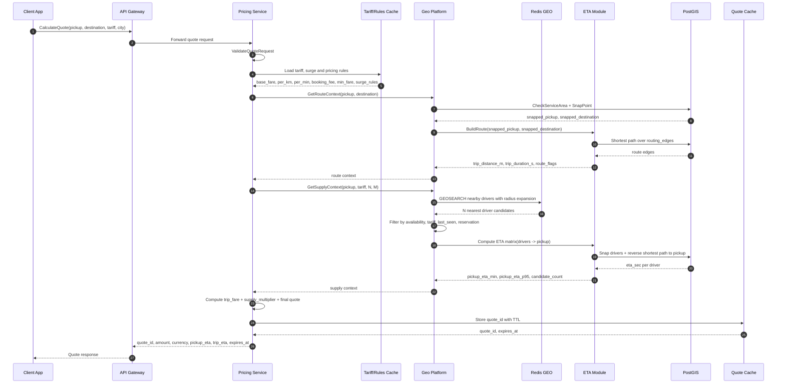
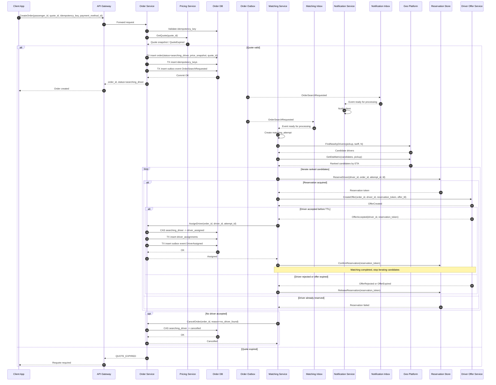
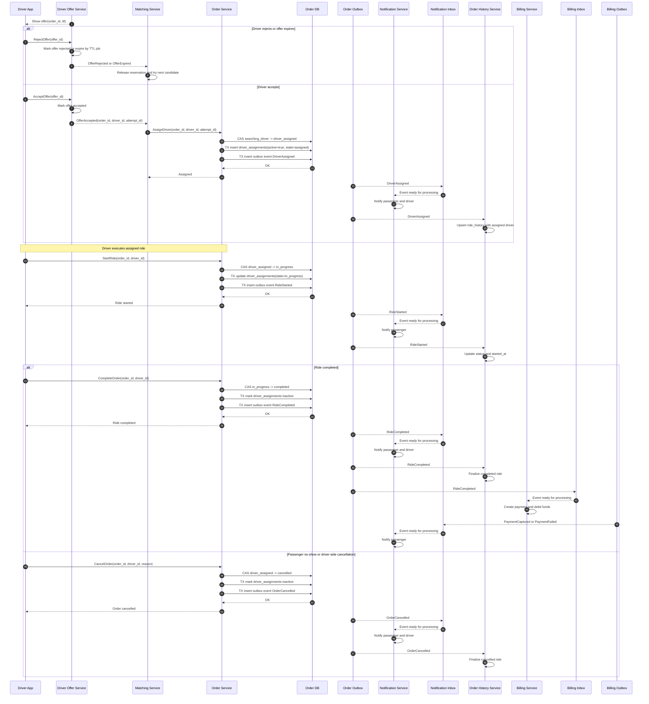
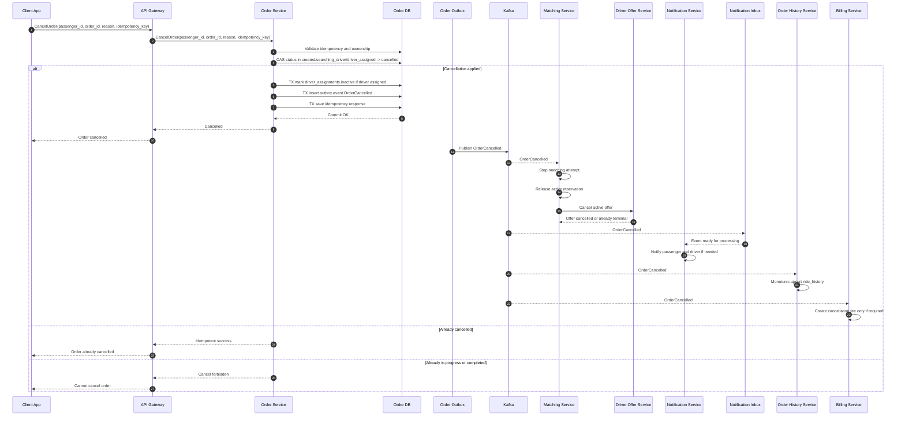
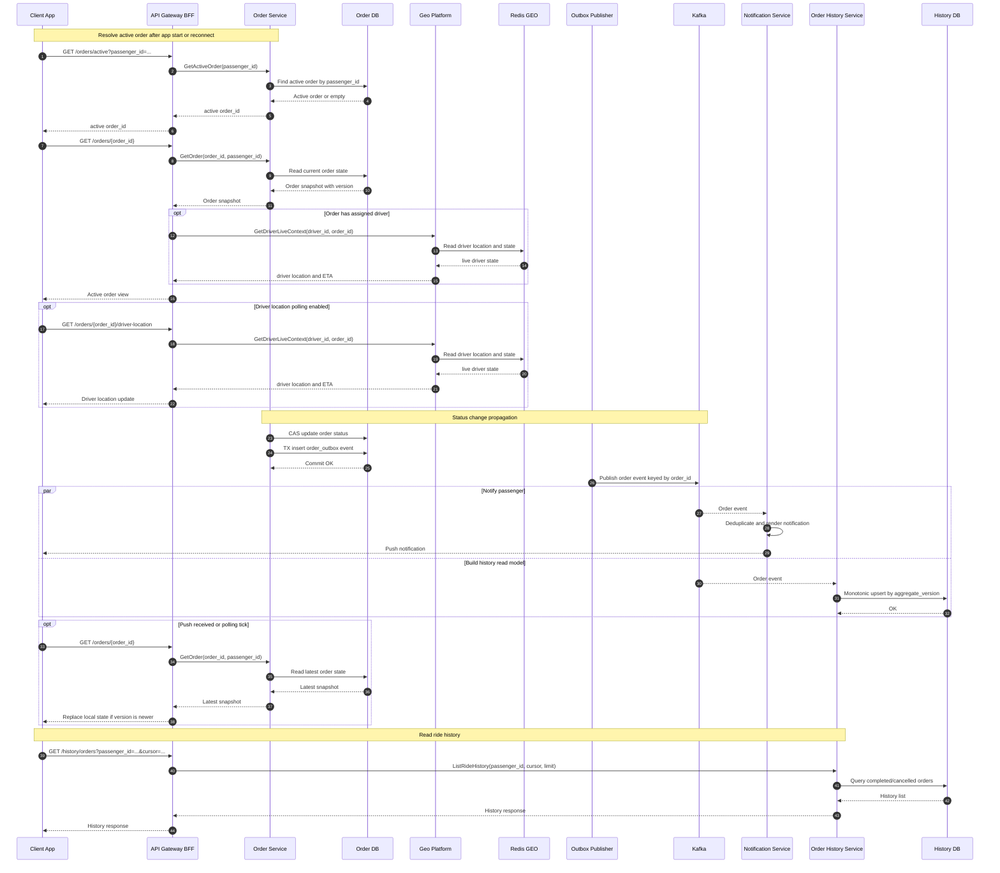
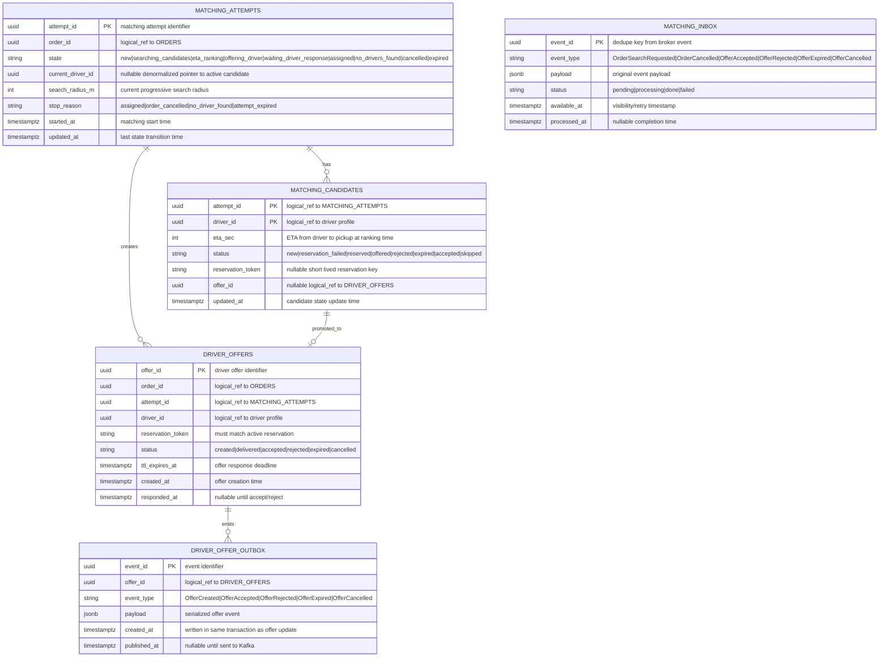
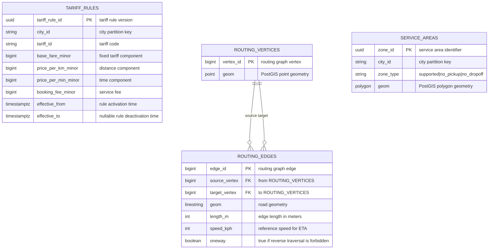
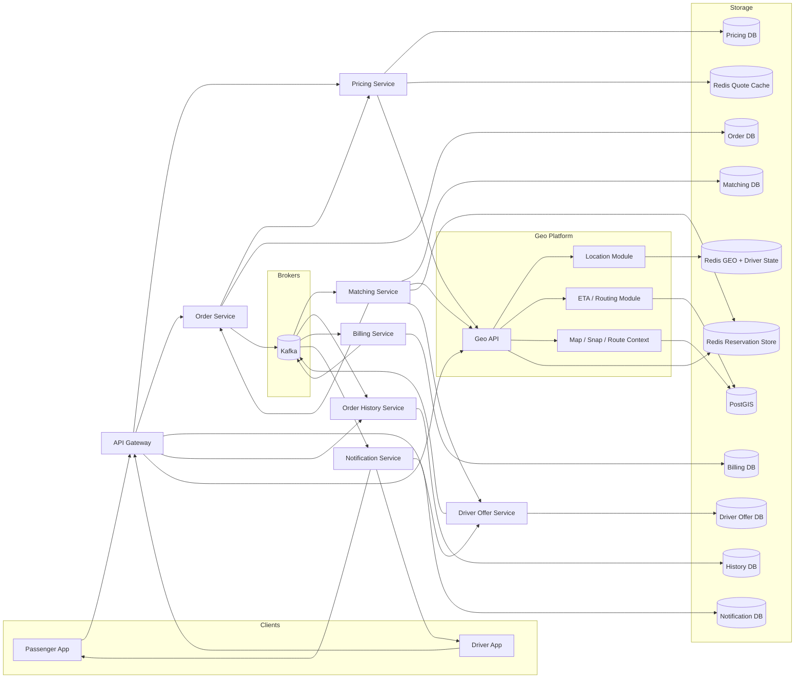

# Техническое решение проекта «Сервис заказа такси»

## Введение
**Цель проекта:**  
Необходимо спроектировать сервис заказа такси, который позволяет пассажиру создать заказ на поездку, подобрать водителя и отслеживать основные статусы заказа до завершения или отмены.

Система должна поддерживать базовый сценарий:
- пассажир указывает точку подачи и точку назначения;
- система создаёт заказ;
- система подбирает подходящего водителя;
- водитель принимает заказ;
- пассажир видит основные изменения статуса;
- поездка завершается или отменяется.

Цель проекта — предложить архитектуру highload-системы, способной обрабатывать большое количество одновременно активных заказов и быстро выполнять подбор водителя.


---

## Глоссарий
| Термин        | Определение |
|---------------|-------------|
| Заказ  | заявка пассажира на поездку |
| Пассажир | пользователь, создающий заказ |
| Водитель | пользователь системы, принимающий и выполняющий заказ |
| Matching | процесс подбора водителя для заказа |
| ETA | ожидаемое время прибытия водителя |
| Idempotency | возможность безопасно повторить запрос без создания дубликатов |
| Статус заказа | текущее состояние поездки |

---

## Функциональные требования
Система должна предоставлять следующие функции:

### Создание заказа

Система должна позволять пассажиру:
- указать точку подачи;
- указать точку назначения;
- создать заказ;
- получить предварительную оценку стоимости.

Каждый заказ должен содержать как минимум:
- order_id;
- passenger_id;
- координаты точки подачи;
- координаты точки назначения;
- время создания;
- текущий статус заказа.

### Управление статусами заказа

Система должна поддерживать как минимум следующие статусы:
- created;
- searching_driver;
- driver_assigned;
- in_progress;
- completed;
- cancelled.

### Подбор водителя

Система должна:
- находить подходящего свободного водителя поблизости;
- назначать заказ только одному водителю;
- предотвращать ситуацию, при которой один заказ одновременно назначается нескольким водителям.

### Действия водителя

Система должна позволять водителю:
- получить предложение о заказе;
- принять заказ;
- отклонить заказ.

Если водитель не принял заказ, система должна продолжить поиск другого кандидата.

### Отмена заказа

Система должна поддерживать отмену заказа:
- пассажиром;
- водителем;
- системой, если водитель не найден за допустимое время.

### История поездок

Система должна позволять пассажиру:
- просматривать список завершённых и отменённых поездок;
- получать базовую информацию о заказе: время, маршрут, статус, стоимость.

---

## Нефункциональные требования

### Нагрузка

Система должна выдерживать:
- до 2 000 новых заказов в секунду в пике;
- до 10 000 запросов в секунду на чтение и обновление активных заказов.

### Производительность

Требования к производительности:
- создание заказа — P95 не более 200 мс;
- получение ответа о назначении водителя — в типовом случае не более 10 секунд;
- чтение текущего состояния активного заказа — P95 не более 100–200 мс.

### Надёжность

Система должна обеспечивать:
- отсутствие потери активных заказов;
- корректную обработку повторных пользовательских запросов;
- устойчивость к сбоям отдельных экземпляров сервисов.

### Консистентность

Для критичных операций требуется согласованность:
- один заказ не может быть назначен нескольким водителям;
- один водитель не может одновременно выполнять несколько активных заказов.

Для истории поездок допускается eventual consistency.

### Масштабируемость

Система должна горизонтально масштабироваться по следующим контурам:
- создание и обработка заказов;
- подбор водителей;
- чтение активных заказов;
- хранение истории поездок.

---

## Пользовательские сценарии

### Получение предварительного расчета стоимости поездки

**Алгоритм:**
1. Gateway принимает запрос `CalculateQuote(pickup, destination, tariff, city, passenger_id)` и передает его в `Pricing Service`.

2. `Pricing Service` выполняет `ValidateQuoteRequest`:
- проверяет формат координат: `lat in [-90, 90]`, `lon in [-180, 180]`;
- проверяет, что `pickup != destination`;
- проверяет, что `tariff` существует и доступен в указанном `city`;
- проверяет базовые продуктовые ограничения, например допустимую максимальную дистанцию между точками.

3. `Pricing Service` вызывает `Geo Platform` методом `GetRouteContext(pickup, destination, city)`.

4. `Geo Platform` внутри `GetRouteContext` выполняет `CheckServiceArea`:
- `service_areas` — это таблица полигонов зон обслуживания: городская зона работы сервиса, зоны запрета посадки, зоны запрета высадки;
- проверяет `pickup` через `service_areas` и `ST_Contains`;
- если `pickup` попадает в `no_pickup`, возвращает ошибку `PICKUP_NOT_SUPPORTED`;
- проверяет `destination` через `service_areas`;
- если `destination` попадает в `no_dropoff`, возвращает ошибку `DROPOFF_NOT_SUPPORTED`.

5. `Geo Platform` выполняет `SnapPoint` для `pickup` и `destination`:
- `snap` означает привязку исходной координаты пользователя к подходящему дорожному сегменту из `routing_edges`;
- ищет ближайшие дорожные сегменты в `routing_edges`;
- для каждого кандидата считает расстояние от исходной точки до линии дороги;
- проверяет, что сегмент доступен для движения и подходит для посадки/высадки;
- если есть направление движения водителя (`heading`), может учитывать штраф за несовпадение направления;
- выбирает сегмент с минимальным score:

```text
score =
  distance_to_segment_m
  + road_class_penalty
  + access_penalty
  + heading_penalty
```

- возвращает `snapped_pickup`, `snapped_destination`, `pickup_edge_id`, `destination_edge_id`.

6. `Geo Platform` выполняет `BuildRoute(snapped_pickup, snapped_destination)`:
- находит стартовую и конечную вершины дорожного графа;
- запускает shortest path по `routing_edges` с весом ребра `edge_duration_s`;
- то есть маршрут является оптимальным относительно выбранной функции стоимости: в базовом варианте это минимальное расчетное время, а не обязательно минимальная дистанция;
- считает `trip_distance_m` как сумму `length_m` по ребрам маршрута;
- считает `trip_duration_s` как сумму времени по ребрам:

```text
edge_duration_s = length_m / (speed_kph * 1000 / 3600)
trip_duration_s = sum(edge_duration_s)
```

7. `Geo Platform` возвращает в `Pricing Service` маршрутный контекст:
- `snapped_pickup`;
- `snapped_destination`;
- `trip_distance_m`;
- `trip_duration_s`;
- `route_confidence`;
- флаги маршрута, например `serviceable`, `uses_toll`, `crosses_special_zone`.

8. `Pricing Service` вызывает `Geo Platform` методом `GetSupplyContext(pickup, tariff, city, N, M)`.

9. `Geo Platform` внутри `GetSupplyContext` выполняет `FindNearbyDrivers`:
- делает `GEOSEARCH drivers:geo:{city}:{tariff}` с progressive radius expansion;
- например сначала `1 km`, затем `2 km`, затем `3 km`, затем `5 km`;
- возвращает не более `N` ближайших водителей по прямой дистанции.

10. `Geo Platform` выполняет `FilterAvailableDrivers`:
- оставляет только `driver:{id}:state.status = available`;
- проверяет свежесть координат через `drivers:last_seen`;
- отбрасывает водителей со stale heartbeat, например старше `15s`;
- отбрасывает водителей с активным `driver:{id}:reservation`;
- отбрасывает водителей не того тарифа или города.

11. `Geo Platform` вызывает ETA-модуль методом `GetEtaMatrix(drivers, pickup)`:
- снапит координаты водителей к `routing_edges`, то есть привязывает GPS-точку каждого водителя к ближайшему подходящему дорожному сегменту;
- снапит точку подачи к дорожному графу;
- считает `ETA(driver -> pickup)` по дорожному графу;
- `many-to-one` означает, что у нас много водителей и одна точка подачи: `driver_1 -> pickup`, `driver_2 -> pickup`, ..., `driver_N -> pickup`;
- вместо N отдельных маршрутов ETA-модуль может запустить reverse shortest path от `pickup` по обратному графу и получить стоимость до всех кандидатских вершин;
- базовая стоимость ребра для ETA:

```text
edge_cost_s = length_m / (speed_kph * 1000 / 3600)
ETA = sum(edge_cost_s по найденному пути)
```

- возвращает ETA по каждому кандидату.

12. `Geo Platform` агрегирует supply context:
- `candidate_count` — сколько доступных водителей найдено после фильтров;
- `pickup_eta_min` — минимальный ETA до точки подачи;
- `pickup_eta_p50` — медианный ETA среди лучших кандидатов;
- `pickup_eta_p95` — pessimistic ETA для оценки дефицита supply;
- `nearest_driver_distance_m` — дистанция до ближайшего кандидата по прямой.

13. `Pricing Service` загружает тарифные правила через `LoadActiveTariffRule(city, tariff, now)`:
- `base_fare_minor`;
- `price_per_km_minor`;
- `price_per_min_minor`;
- `booking_fee_minor`;
- `minimum_fare_minor`;
- опционально `surge_rules`.

14. `Pricing Service` считает базовую цену маршрута:

```text
trip_distance_km = trip_distance_m / 1000
trip_duration_min = trip_duration_s / 60

trip_fare =
  base_fare_minor
  + trip_distance_km * price_per_km_minor
  + trip_duration_min * price_per_min_minor
  + booking_fee_minor
```

15. `Pricing Service` считает коэффициент доступности `supply_multiplier`:
- если `candidate_count = 0`, quote можно не выдавать и вернуть `NO_DRIVERS_AVAILABLE`;
- если `candidate_count` мал или `pickup_eta_p95` высокий, применяется повышающий коэффициент;
- если supply нормальный, `supply_multiplier = 1.0`.

Пример:

```text
if candidate_count < 3:
  supply_multiplier = 1.3
else if pickup_eta_p95 > 600:
  supply_multiplier = 1.2
else:
  supply_multiplier = 1.0
```

16. `Pricing Service` считает итоговую предварительную стоимость:

```text
subtotal = trip_fare * supply_multiplier
quote_amount_minor = max(subtotal, minimum_fare_minor)
quote_amount_minor = round_to_pricing_step(quote_amount_minor)
```

Цена не зависит от одного конкретного ближайшего водителя. `Supply context` используется для оценки доступности машин и примерного ETA подачи, а не для жесткой привязки quote к будущему назначенному водителю.

17. `Pricing Service` создает `quote` через `CreateQuote`:
- генерирует `quote_id`;
- сохраняет `pickup`, `destination`, snapped-точки, тариф, `trip_distance_m`, `trip_duration_s`, `pickup_eta_min`, `pickup_eta_p95`, `quote_amount_minor`, `currency`;
- кладет quote в Redis по ключу `quote:{quote_id}` с TTL `60s`.

`TTL 60s` — это срок валидности предварительного расчета. Он нужен, потому что водители двигаются, supply меняется, ETA подачи устаревает, а тарифные коэффициенты могут быть пересчитаны. Если клиент создает заказ после истечения TTL, `Order Service` должен вернуть `QUOTE_EXPIRED` и попросить клиента получить новый quote.

18. `Pricing Service` возвращает клиенту:
- `quote_id`;
- `amount_minor`;
- `currency`;
- `pickup_eta_sec`;
- `trip_duration_s`;
- `trip_distance_m`;
- `expires_at`.

Сиквенс-диаграмма:



### Создание заказа пользователем

**Алгоритм:**
1. Клиент отправляет `CreateOrder(passenger_id, quote_id, idempotency_key, payment_method_id)` в `Gateway`.

Запрос не должен заново передавать цену как источник истины. Цена, маршрутный контекст и координаты берутся из `quote`, который был создан на этапе `CalculateQuote`.

2. `Gateway` выполняет пограничные проверки и проксирует команду в `Order Service`:
- проверяет наличие `idempotency_key`;
- вызывает `Order Service.CreateOrder`.

3. `Order Service` выполняет `ValidateIdempotencyKey(scope=create_order, passenger_id, idempotency_key)`:
- если ключ уже есть и request hash совпадает, возвращает ранее сохраненный результат;
- если ключ уже есть, но request hash отличается, возвращает `IDEMPOTENCY_KEY_CONFLICT`;
- если ключа нет, продолжает создание заказа.

Идемпотентность нужна, потому что мобильный клиент может повторить запрос из-за timeout, retry или потери сети.

Для этого используется таблица `idempotency_keys` в БД `Order Service`.

Если первый запрос успешно создал заказ, повторный запрос с тем же ключом не создает новый заказ, а возвращает сохраненный `response_payload`.

4. `Order Service` вызывает `Pricing Service.GetQuote(quote_id)`:
- если quote найден и не истек, возвращается `quote snapshot`;
- если quote истек, возвращается `QUOTE_EXPIRED`;
- если quote принадлежит другому пассажиру или городу, возвращается `QUOTE_NOT_VALID`.

`Order Service` в своей БД через уникальное ограничение или lookup по `orders.quote_id`. Если по этому `quote_id` уже существует активный заказ, `Order Service` возвращает `QUOTE_ALREADY_USED`.

`quote snapshot` фиксирует:
- `pickup`, `destination`;
- snapped-точки;
- `tariff_id`, `city_id`;
- `trip_distance_m`, `trip_duration_s`;
- `estimated_price_minor`, `currency`;
- `expires_at`.

5. `Order Service` открывает транзакцию в `Order DB` и создает заказ:
- генерирует `order_id`;
- вставляет строку в `orders`;
- сохраняет `price_snapshot` из quote;
- выставляет `status=searching_driver`;
- сохраняет `version=1`;
- сохраняет запись в `idempotency_keys`, чтобы повторный `CreateOrder` вернул тот же `order_id`;
- пишет `OrderSearchRequested` в `order_outbox`.

Эти действия должны быть атомарными: если заказ создан, то событие для matching тоже должно быть сохранено.

6. `Order Service` коммитит транзакцию и синхронно отвечает клиенту:

```json
{
  "order_id": "uuid",
  "status": "searching_driver",
  "estimated_price_minor": 120000,
  "currency": "RUB"
}
```

На этом синхронный путь создания заказа завершается. Подбор водителя запускается асинхронно, чтобы `CreateOrder` укладывался в низкий P95 и не ждал ETA, Redis GEO и ответы водителей.

7. `Order Outbox Publisher` читает `order_outbox` и публикует `OrderSearchRequested` в Kafka topic `order.events.v1`:
- `Kafka key = order_id`;
- после успешной публикации заполняет `published_at`;
- если Kafka недоступна, событие остается в outbox и будет отправлено позже.

8. `Notification Service` получает `OrderSearchRequested`:
- сохраняет событие в `notification_inbox` по `event_id`;
- дедуплицирует повторную доставку;
- отправляет пассажиру push-уведомление “Ищем водителя”.

9. `Matching Service` получает `OrderSearchRequested`:
- сохраняет событие в `matching_inbox` по `event_id`;
- если событие уже обработано, повтор игнорируется;
- worker берет событие в работу и создает `matching_attempt`.

10. `Matching Service` создает `matching_attempt`:
- `state=new`;
- `order_id`;
- `started_at`;
- `search_radius_m`;
- затем переводит state machine в `searching_candidates`.

Для одного заказа допускается только одна незавершенная `matching_attempt`.

11. `Matching Service` вызывает `Geo Platform.FindNearbyDrivers(pickup, tariff, city, N)`:
- `Geo Platform` делает `GEOSEARCH drivers:geo:{city}:{tariff}`;
- применяет progressive radius expansion;
- фильтрует водителей по `driver:{id}:state.status=available`;
- фильтрует stale-координаты через `drivers:last_seen`;
- исключает водителей с активной `driver:{id}:reservation`;
- возвращает shortlist кандидатов.

12. `Matching Service` вызывает `Geo Platform.GetEtaMatrix(candidates, pickup)`:
- ETA-модуль снапит водителей и pickup к дорожному графу;
- считает `ETA(driver -> pickup)`;
- возвращает `driver_id -> eta_sec`.

13. `Matching Service` ранжирует кандидатов и сохраняет их в `matching_candidates`:

```text
score =
  eta_sec
  + freshness_penalty
  + business_penalty
```

Примеры бизнес-правил:
- не предлагать заказ водителю с устаревшей координатой;
- штрафовать водителей с низкой confidence GPS;
- учитывать тариф, класс машины и локальные правила dispatch.

14. `Matching Service` переходит к кандидатам по ranking и перед каждым оффером вызывает `ReserveDriver(driver_id, order_id, attempt_id, ttl)`:
- резервация создается в Redis через `SET driver:{id}:reservation ... NX EX`;
- если `SET NX` не сработал, водитель уже занят другой попыткой, кандидат получает статус `reservation_failed`;
- если резервация взята, кандидат получает статус `reserved`.

Резервация нужна, чтобы два parallel matching-процесса не отправили оффер одному водителю одновременно.

15. `Matching Service` вызывает `Driver Offer Service.CreateOffer(order_id, attempt_id, driver_id, reservation_token, offer_ttl)`:
- `Driver Offer Service` создает запись в `driver_offers` со статусом `created`;
- создает TTL-задачу `driver_offer.expire`;
- публикует или доставляет оффер в driver app через push-уведомление;
- пишет событие `OfferCreated` в `driver_offer_outbox`.

`driver_offer.expire` — это отложенная задача в локальной `pgqueue` сервиса офферов. Она планируется на `now() + offer_ttl`. Когда worker берет задачу, он проверяет текущий статус оффера: если оффер все еще `created` или `delivered`, сервис переводит его в `expired` и публикует `OfferExpired`; если водитель уже ответил, задача ничего не меняет.

16. Если водитель принимает оффер, `Driver Offer Service` обрабатывает `AcceptOffer(offer_id)`:
- проверяет, что offer еще не истек;
- переводит `driver_offers.status` в `accepted`;
- публикует `OfferAccepted` в `driver_offer.events.v1`;
- `Matching Service` получает событие через `matching_inbox`.

17. `Matching Service` на `OfferAccepted` вызывает `Order Service.AssignDriver(order_id, driver_id, attempt_id)`:
- `Order Service` открывает транзакцию;
- выполняет CAS-переход `searching_driver -> driver_assigned`;
- вставляет запись в `driver_assignments`;
- пишет `DriverAssigned` в `order_outbox`;
- коммитит транзакцию.

CAS-условие защищает заказ от гонки с клиентской отменой или другим accepted offer. `Matching Service` не обязан знать `orders.version`: командный метод `AssignDriver` внутри `Order Service` сам выполняет условное обновление по ожидаемому статусу.

```sql
UPDATE orders
SET
  status = 'driver_assigned',
  driver_id = :driver_id,
  version = version + 1,
  updated_at = now()
WHERE order_id = :order_id
  AND status = 'searching_driver';
```

Partial unique index `unique(driver_id) where active=true` дополнительно гарантирует, что один водитель не может иметь два активных заказа.

18. Если `AssignDriver` успешен:
- `Matching Service` переводит `matching_attempt.state=assigned`;
- подтверждает или снимает Redis reservation в runtime-хранилище;
- больше не предлагает заказ другим водителям;
- `Notification Service` по событию `DriverAssigned` уведомляет пассажира, что водитель найден.

19. Если водитель отклоняет оффер или TTL истекает:
- `Driver Offer Service` переводит offer в `rejected` или `expired`;
- публикует `OfferRejected` или `OfferExpired`;
- `Matching Service` получает событие;
- снимает `driver:{id}:reservation`;
- обновляет `matching_candidates.status`;
- переходит к следующему кандидату.

20. Если кандидаты закончились или истек общий timeout matching:
- `Matching Service` переводит attempt в `no_drivers_found` или `expired`;
- вызывает `Order Service.CancelOrder(order_id, reason=no_driver_found)`;
- `Order Service` выполняет CAS-переход `searching_driver -> cancelled`;
- пишет `OrderCancelled` в `order_outbox`;
- `Notification Service` уведомляет пассажира, что водитель не найден.

21. Если клиент отменил заказ во время matching:
- `Order Service` публикует `OrderCancelled`;
- `Matching Service` получает событие через `matching_inbox`;
- останавливает `matching_attempt`;
- снимает активные reservations;
- закрывает активные offers через `Driver Offer Service`.

Сиквенс-диаграмма:



### Исполнение заказа водителем

**Алгоритм:**

1. `Driver App` получает оффер через `Driver Offer Service`.

Оффер содержит:
- `offer_id`;
- `order_id`;
- `pickup`;
- `destination`;
- `estimated_price_minor`;
- `pickup_eta`;
- `ttl_expires_at`;
- действия `AcceptOffer` и `RejectOffer`.

На этом этапе заказ еще не считается назначенным. Назначение произойдет только после успешного `AssignDriver` в `Order Service`.

2. Если водитель отклоняет оффер, `Driver App` вызывает `Driver Offer Service.RejectOffer(offer_id)`:
- `Driver Offer Service` проверяет, что оффер находится в статусе `created` или `delivered`;
- переводит `driver_offers.status` в `rejected`;
- пишет событие `OfferRejected` в `driver_offer_outbox`;
- `Matching Service` получает `OfferRejected`, снимает `driver:{id}:reservation`, обновляет `matching_candidates.status=rejected` и переходит к следующему кандидату.

3. Если водитель не отвечает до `ttl_expires_at`, срабатывает отложенная задача `driver_offer.expire`:
- worker `Driver Offer Service` читает TTL-задачу из локальной `pgqueue`;
- проверяет текущий статус оффера;
- если оффер все еще `created` или `delivered`, переводит его в `expired`;
- пишет событие `OfferExpired` в `driver_offer_outbox`;
- `Matching Service` получает `OfferExpired`, снимает reservation и пробует следующего водителя.

4. Если водитель принимает оффер, `Driver App` вызывает `Driver Offer Service.AcceptOffer(offer_id)`:
- `Driver Offer Service` проверяет, что оффер еще не истек;
- проверяет, что оффер еще не `accepted/rejected/expired/cancelled`;
- переводит `driver_offers.status` в `accepted`;
- пишет событие `OfferAccepted` в `driver_offer_outbox`.

Если `AcceptOffer` пришел после TTL, сервис возвращает `OFFER_EXPIRED`, а matching продолжает поиск другого кандидата.

5. `Matching Service` получает `OfferAccepted` через `matching_inbox` и вызывает `Order Service.AssignDriver(order_id, driver_id, attempt_id)`:
- `Order Service` открывает транзакцию;
- выполняет CAS-переход `searching_driver -> driver_assigned`;
- записывает `driver_id` в `orders`;
- вставляет строку в `driver_assignments`;
- пишет `DriverAssigned` в `order_outbox`;
- коммитит транзакцию.

Пример CAS-обновления:

```sql
UPDATE orders
SET
  status = 'driver_assigned',
  driver_id = :driver_id,
  version = version + 1,
  updated_at = now()
WHERE order_id = :order_id
  AND status = 'searching_driver';
```

Если обновлено `0` строк, заказ уже мог быть отменен или назначен другим потоком. Тогда `AssignDriver` возвращает conflict, а `Matching Service` освобождает reservation.

6. После успешного `AssignDriver`:
- `Matching Service` переводит `matching_attempt.state=assigned`;
- подтверждает или снимает Redis reservation в runtime-хранилище;
- `Notification Service` получает `DriverAssigned` и уведомляет пассажира;
- `Order History Service` делает `upsert` в `ride_history`: сохраняет `order_id`, `passenger_id`, `driver_id`, маршрут, тариф, `estimated_price_minor`, `currency`, `status=driver_assigned`;
- `Driver App` начинает показывать активный заказ водителю;
- дальнейшие действия водителя идут уже не через `Driver Offer Service`, а через команды в `Order Service`.

7. Когда водитель приехал и пассажир сел в машину, `Driver App` вызывает `Order Service.StartRide(order_id, driver_id)`:
- `Order Service` проверяет, что заказ находится в `driver_assigned`;
- проверяет, что `driver_id` совпадает с назначенным водителем;
- выполняет CAS-переход `driver_assigned -> in_progress`;
- обновляет `driver_assignments.state` в `in_progress`;
- пишет `RideStarted` в `order_outbox`;
- возвращает водителю подтверждение старта поездки.

Пример CAS:

```sql
UPDATE orders
SET
  status = 'in_progress',
  version = version + 1,
  updated_at = now()
WHERE order_id = :order_id
  AND driver_id = :driver_id
  AND status = 'driver_assigned';
```

8. `Order Outbox Publisher` публикует `RideStarted` в `order.events.v1`:
- `Notification Service` уведомляет пассажира, что поездка началась;
- `Order History Service` обновляет read model: проставляет `driver_id`, `status=in_progress`, `started_at` и `updated_at` во внутренней проекции заказа;
- другие сервисы могут использовать событие для аналитики.

9. Когда водитель довез пассажира, `Driver App` вызывает `Order Service.CompleteOrder(order_id, driver_id)`:
- `Order Service` проверяет, что заказ находится в `in_progress`;
- проверяет, что команду выполняет назначенный водитель;
- фиксирует `completed_at`;
- рассчитывает или принимает финальные метрики поездки: `final_distance_m`, `final_duration_s`, `final_price_minor`;
- выполняет CAS-переход `in_progress -> completed`;
- деактивирует запись в `driver_assignments`: `active=false`, `state=released`, `released_at=now()`, `release_reason=completed`;
- пишет `RideCompleted` в `order_outbox`.

10. После публикации `RideCompleted`:
- `Billing Service` получает событие через `billing_inbox`;
- создает запись `payments` со статусом `pending`;
- выполняет списание средств;
- публикует `PaymentCaptured` или `PaymentFailed` в `billing.events.v1`;
- `Notification Service` уведомляет пассажира о завершении поездки и результате оплаты;
- `Order History Service` финализирует запись истории: проставляет `status=completed`, `finished_at`, `final_price_minor`, `trip_distance_m`, `trip_duration_s`, `driver_id`, `pickup`, `destination`, `currency`.

Важно: поездка уже может быть `completed`, даже если платеж позже завершился `failed`. Финансовый статус не должен откатывать статус поездки.

11. Если пассажир не сел в машину, водитель вызывает `Order Service.CancelOrder(order_id, driver_id, reason=passenger_no_show)`:
- `Order Service` разрешает такую отмену только из `driver_assigned`;
- проверяет, что отменяет назначенный водитель;
- выполняет CAS-переход `driver_assigned -> cancelled`;
- деактивирует запись в `driver_assignments`: `active=false`, `state=released`, `released_at=now()`, `release_reason=passenger_no_show`;
- пишет `OrderCancelled` в `order_outbox`;
- `Billing Service` может начислить cancellation fee, если такая политика включена;
- `Notification Service` уведомляет пассажира и водителя;
- `Order History Service` финализирует запись истории: проставляет `status=cancelled`, `finished_at`, `cancel_reason`, `driver_id`, маршрут и стоимость, если они уже были известны.

12. Если водитель отменяет заказ до посадки по другой причине, используется тот же `CancelOrder`, но с другим `cancel_reason`, например `driver_cancelled`.

Такая отмена разрешена до `in_progress`. После `in_progress` обычная отмена водителем запрещена: поездку нужно завершать через `CompleteOrder` или разбирать отдельным support-flow.

Сиквенс-диаграмма:



### Отмена заказа клиентом

**Алгоритм:**
1. Клиент отправляет `CancelOrder(passenger_id, order_id, reason, idempotency_key)` в `Gateway`.

`passenger_id` считаем уже проверенным на уровне внешней авторизации и переданным внутрь системы как trusted input.

2. `Gateway` выполняет только пограничные проверки:
- проверяет, что переданы `order_id`, `passenger_id`, `reason`;
- проксирует команду в `Order Service.CancelOrder`.

3. `Order Service` выполняет идемпотентность отмены:
- использует `idempotency_keys` со `scope=cancel_order`;
- если такой ключ уже обработан и request hash совпадает, возвращает сохраненный `response_payload`;
- если ключ уже есть, но request hash отличается, возвращает `IDEMPOTENCY_KEY_CONFLICT`;
- если ключа нет, продолжает выполнение.

Идемпотентность нужна, потому что клиент почти наверняка будет ретраить отмену при плохой сети. Без нее можно получить несколько разных ответов на одну пользовательскую команду.

4. `Order Service` читает заказ из `Order DB` и проверяет ownership:
- `orders.order_id = order_id`;
- `orders.passenger_id = passenger_id`;
- если заказ не найден, возвращает `ORDER_NOT_FOUND`;
- если заказ принадлежит другому пассажиру, возвращает `ORDER_NOT_FOUND` или `FORBIDDEN`.

5. `Order Service` проверяет допустимость перехода:
- `created -> cancelled` разрешен;
- `searching_driver -> cancelled` разрешен;
- `driver_assigned -> cancelled` разрешен, но нужно уведомить назначенного водителя и освободить assignment;
- `in_progress -> cancelled` запрещен для клиента, потому что поездка уже началась;
- `completed -> cancelled` запрещен;
- `cancelled -> cancelled` возвращается как идемпотентный успех.

6. `Order Service` выполняет CAS-переход в одной транзакции:
- условно обновляет заказ только если текущий статус входит в `created/searching_driver/driver_assigned`;
- выставляет `status=cancelled`;
- выставляет `cancel_reason=client_cancelled` или более конкретную причину клиента;
- увеличивает `orders.version`;
- если у заказа был назначенный водитель, деактивирует `driver_assignments`;
- пишет `OrderCancelled` в `order_outbox` с `aggregate_version = orders.version`;
- сохраняет результат в `idempotency_keys`.

Пример CAS:

```sql
UPDATE orders
SET
  status = 'cancelled',
  cancel_reason = :cancel_reason,
  version = version + 1,
  updated_at = now()
WHERE order_id = :order_id
  AND passenger_id = :passenger_id
  AND status IN ('created', 'searching_driver', 'driver_assigned')
RETURNING order_id, driver_id, status, version;
```

Если `driver_id IS NOT NULL`, в той же транзакции закрывается активное назначение:

```sql
UPDATE driver_assignments
SET
  active = false,
  state = 'released',
  released_at = now(),
  release_reason = 'client_cancelled',
  updated_at = now()
WHERE order_id = :order_id
  AND active = true;
```

Важно: запись в `driver_assignments` не удаляется. Она остается историей факта, что водитель был назначен, но assignment был освобожден из-за отмены клиентом.

7. Если CAS обновил `0` строк, `Order Service` перечитывает текущий статус:
- если статус уже `cancelled`, возвращает идемпотентный успех;
- если статус `in_progress`, возвращает `CANCEL_FORBIDDEN_RIDE_IN_PROGRESS`;
- если статус `completed`, возвращает `CANCEL_FORBIDDEN_RIDE_COMPLETED`;
- если заказа нет, возвращает `ORDER_NOT_FOUND`.

8. После коммита `Order Service` синхронно отвечает клиенту:

```json
{
  "order_id": "uuid",
  "status": "cancelled",
  "cancel_reason": "client_cancelled"
}
```

9. `Order Outbox Publisher` публикует `OrderCancelled` в `order.events.v1`.

Событие должно содержать snapshot, достаточный для подписчиков:
- `order_id`;
- `passenger_id`;
- `driver_id`, если водитель был назначен;
- `previous_status`;
- `cancel_reason`;
- `cancelled_by=passenger`;
- `pickup`, `destination`;
- `estimated_price_minor`, `final_price_minor`, если есть cancellation fee;
- `aggregate_version`.

10. `Matching Service` получает `OrderCancelled` через `matching_inbox` и идемпотентно останавливает matching:
- находит активный `matching_attempt` по `order_id`;
- если attempt уже в terminal state, ничего не меняет;
- переводит `matching_attempt.state=cancelled`;
- выставляет `stop_reason=order_cancelled`;
- снимает активный Redis reservation по `reservation_token`;
- помечает текущего кандидата как `skipped` или `expired`, если оффер уже был неактуален;
- вызывает `Driver Offer Service.CancelOffer(order_id, reason=order_cancelled)` для активного оффера.

11. `Driver Offer Service` закрывает активные офферы:
- выполняет CAS `driver_offers.status IN ('created', 'delivered') -> cancelled`;
- если оффер уже `rejected/expired/cancelled`, операция считается идемпотентной;
- если оффер уже `accepted`, `Driver Offer Service` не решает судьбу заказа сам: итоговый source of truth все равно `Order Service`;
- публикует `OfferCancelled`, чтобы приложение водителя убрало оффер с экрана.

12. Если отмена произошла после `driver_assigned`:
- `Order Service` уже деактивировал `driver_assignments`;
- водитель больше не считается занятым активным заказом;
- runtime-состояние водителя можно вернуть в `available`, если у него нет другого активного assignment;
- `Notification Service` отправляет водителю пуш “Заказ отменен пассажиром”.

13. Если гонка произошла одновременно с принятием оффера водителем:
- `Driver Offer Service` может успеть опубликовать `OfferAccepted`;
- `Matching Service` попробует вызвать `AssignDriver`;
- `Order Service.AssignDriver` выполнит CAS `searching_driver -> driver_assigned`;
- так как заказ уже `cancelled`, CAS обновит `0` строк;
- `Matching Service` освободит reservation и завершит attempt как `order_cancelled`.

За счет этого заказ не может снова стать `driver_assigned` после клиентской отмены.

14. `Notification Service` получает `OrderCancelled`:
- пассажиру отправляет подтверждение отмены;
- водителю отправляет уведомление только если был `driver_id` или активный offer;
- клиент обновит активный экран после push-уведомления или через очередной polling `GET /orders/{order_id}`.

15. `Order History Service` получает `OrderCancelled`:
- делает monotonic upsert по `aggregate_version`;
- выставляет `status=cancelled`;
- заполняет `finished_at`;
- сохраняет `cancel_reason`;
- сохраняет `driver_id`, если водитель уже был назначен;
- сохраняет маршрут и стоимость для будущей истории поездок.

16. `Billing Service` получает `OrderCancelled`:
- если отмена бесплатная, платеж не создается;
- если политика тарифа предусматривает cancellation fee, создает `payments` на сумму штрафа;
- публикует `PaymentCaptured` или `PaymentFailed`;
- статус заказа при этом не откатывается из `cancelled`.

Сиквенс-диаграмма:



### Просмотр состояния заказа

В этом сценарии важно разделить два разных read path:
- активный заказ читается из `Order Service`, потому что это source of truth;
- архив поездок читается из `Order History Service`, потому что это eventually consistent read model.

Активный экран = Order Service
Архив поездок = Order History Service

**Алгоритм просмотра активного заказа:**
1. После `CreateOrder` клиент получает `order_id` и открывает экран активного заказа.

2. `Client App` сохраняет `active_order_id` локально:
- в памяти приложения для текущей сессии;
- в persistent storage приложения, чтобы пережить перезапуск;
- вместе с последним известным `status` и `version`.

3. При открытии приложения, реконнекте или возврате на экран клиент определяет актуальный `order_id`:
- сначала берет `active_order_id` из локального состояния;
- затем вызывает `GET /orders/active?passenger_id=...`;
- `Order Service` возвращает активный заказ пассажира, если он есть;
- если локальный `active_order_id` отличается от ответа сервера, клиент доверяет серверу;
- если активного заказа нет, клиент очищает локальный `active_order_id`.

Так мы не зависим от того, сохранился ли `order_id` в памяти мобильного приложения после реконнекта.

4. Сразу после открытия экрана клиент делает initial read:

```http
GET /orders/{order_id}
```

5. `Gateway/BFF` проксирует запрос в `Order Service.GetOrder(order_id, passenger_id)`.

6. `Order Service` читает `orders` из `Order DB`:
- проверяет, что заказ существует;
- проверяет `orders.passenger_id = passenger_id`;
- возвращает текущий status snapshot из source of truth.

Минимальный response:

```json
{
  "order_id": "uuid",
  "status": "searching_driver",
  "passenger_id": "uuid",
  "driver_id": null,
  "pickup": {"lat": 59.93, "lon": 30.31},
  "destination": {"lat": 59.95, "lon": 30.35},
  "estimated_price_minor": 120000,
  "final_price_minor": null,
  "currency": "RUB",
  "cancel_reason": null,
  "version": 3,
  "updated_at": "2026-04-26T12:00:00Z"
}
```

7. Если заказ уже в `driver_assigned` или `in_progress`, `Gateway/BFF` может дополнительно собрать view model для экрана:
- получить driver profile из `Driver/Profile Service`, если такой сервис есть;
- получить live координату водителя из `Geo Platform`, которая читает Redis `drivers:geo:{city}:{tariff}` / `driver:{id}:state`;
- получить актуальный ETA `driver -> pickup` или `driver -> destination` из `Geo Platform`;
- вернуть клиенту обогащенный payload.

Важно: это обогащение не меняет источник истины по статусу заказа. Статус все равно берется из `Order Service`.

8. Если приложению нужно обновлять live координату водителя, клиент периодически вызывает:

```http
GET /orders/{order_id}/driver-location
```

`Gateway/BFF` внутри вызывает `Geo Platform.GetDriverLiveContext(driver_id, order_id)`.

Это отдельный lightweight polling для карты. Он не трогает `Order Service`, кроме проверки доступа к заказу.

9. Когда `Order Service` меняет статус заказа, он в той же транзакции пишет событие в `order_outbox`:
- `OrderSearchRequested`;
- `DriverAssigned`;
- `RideStarted`;
- `RideCompleted`;
- `OrderCancelled`.

10. `Order Outbox Publisher` публикует событие в `order.events.v1` с:
- `Kafka key = order_id`;
- `aggregate_version = orders.version`;
- snapshot полей, нужных подписчикам.

11. `Notification Service` получает событие и отправляет клиенту push notification:
- “Ищем водителя”;
- “Водитель найден”;
- “Поездка началась”;
- “Поездка завершена”;
- “Заказ отменен”.

Push только сигнализирует клиенту, что стоит перечитать состояние заказа из `Order Service`.

12. После получения push или при периодическом polling клиент вызывает:

```http
GET /orders/{order_id}
```

13. `Order Service` возвращает актуальный snapshot заказа из `Order DB`.

14. Клиент применяет новый snapshot только если версия новее локальной:

```text
if response.version > local_order_version:
    replace_local_order_snapshot()
else:
    keep_local_order_snapshot()
```

Это защищает UI от повторных push-уведомлений, задержек сети и старых ответов после retry.

15. Если push не дошел, приложение все равно обновится через polling:
- активный экран может опрашивать `GET /orders/{order_id}` раз в несколько секунд;
- частоту polling можно снижать, если приложение в background;
- при возврате приложения в foreground клиент всегда делает `GET /orders/active`.

16. Если статус стал `completed` или `cancelled`:
- активный экран показывает финальное состояние;
- клиент может закрыть экран активной поездки;
- в архиве поездка появится после того, как `Order History Service` обработает событие;
- если пользователь сразу открыл историю и записи еще нет, UI может показать “история обновляется” или временно взять финальный snapshot из `Order Service`.

**Алгоритм просмотра истории поездок:**
1. Клиент открывает экран истории поездок.

2. `Client App` вызывает:

```http
GET /history/orders?passenger_id=...&limit=20&cursor=...
```

3. `Gateway/BFF` проксирует запрос в `Order History Service`.

4. `Order History Service` читает `ride_history` из своей БД:
- фильтр `passenger_id`;
- обычно только терминальные статусы `completed/cancelled`;
- сортировка по `finished_at DESC`;
- pagination через cursor.

Как работает cursor pagination:
- первая страница запрашивается без `cursor`;
- сервис берет `limit + 1` записей, например при `limit=20` читает `21` запись;
- первые `20` записей возвращаются клиенту;
- если была `21`-я запись, значит есть следующая страница, и сервис возвращает `next_cursor`;
- `next_cursor` строится из последней реально возвращенной записи, а не из лишней `21`-й записи.

Проблемы offset:
- `OFFSET 10000 LIMIT 20` заставляет БД пройти и отбросить первые `10000` строк;
- при растущей истории поездок это становится медленно;
- cursor pagination сразу продолжает чтение “после последней виденной записи”.

Для истории поездок cursor удобно строить по двум полям:
- `finished_at` — основная сортировка по времени завершения поездки;
- `order_id` — tie-breaker, если несколько поездок имеют одинаковый `finished_at`.

Сортировка:

```sql
ORDER BY finished_at DESC, order_id DESC
```

Первый запрос:

```http
GET /history/orders?passenger_id=...&limit=20
```

SQL для первой страницы:

```sql
SELECT *
FROM ride_history
WHERE passenger_id = :passenger_id
  AND status IN ('completed', 'cancelled')
ORDER BY finished_at DESC, order_id DESC
LIMIT :limit_plus_one;
```

Пример `next_cursor`:

```json
{
  "finished_at": "2026-04-26T12:00:00Z",
  "order_id": "018f7f3e-8b40-7c6d-9c5d-1a2b3c4d5e6f"
}
```

Клиент не должен парсить cursor. Он просто передает его в следующий запрос:

```http
GET /history/orders?passenger_id=...&limit=20&cursor=eyJmaW5pc2hlZF9hdCI6...
```

SQL для следующей страницы:

```sql
SELECT *
FROM ride_history
WHERE passenger_id = :passenger_id
  AND status IN ('completed', 'cancelled')
  AND (
    finished_at < :cursor_finished_at
    OR (
      finished_at = :cursor_finished_at
      AND order_id < :cursor_order_id
    )
  )
ORDER BY finished_at DESC, order_id DESC
LIMIT :limit_plus_one;
```

Почему условие именно такое:
- мы сортируем от новых поездок к старым;
- значит следующая страница должна брать записи “старше” последней записи предыдущей страницы;
- если `finished_at` совпал, используем `order_id`, чтобы порядок был стабильным и поездки не пропадали между страницами.

Индекс для такой пагинации:

```sql
CREATE INDEX ride_history_passenger_finished_order_idx
ON ride_history (passenger_id, finished_at DESC, order_id DESC)
WHERE status IN ('completed', 'cancelled');
```

5. `Order History Service` возвращает список поездок:
- `order_id`;
- `status`;
- `pickup`, `destination`;
- `created_at`, `started_at`, `finished_at`;
- `estimated_price_minor`, `final_price_minor`;
- `currency`;
- `driver_id`, если был назначен;
- `cancel_reason`, если заказ отменен.

6. Если пользователь открывает конкретную историческую поездку:
- базовые данные читаются из `Order History Service`;
- платежные детали при необходимости можно дозагрузить из `Billing Service`;
- подробный маршрут можно дозагрузить из `Geo Platform` или хранить в `ride_history` как route snapshot.

Что именно обновляет `Order History Service`:
- на `DriverAssigned` делает `upsert` записи по `order_id`: сохраняет пассажира, водителя, маршрут, тариф, предварительную стоимость и `status=driver_assigned`;
- на `RideStarted` обновляет `status=in_progress`, `started_at`, `updated_at`;
- на `RideCompleted` обновляет `status=completed`, `finished_at`, `final_price_minor`, `trip_distance_m`, `trip_duration_s`;
- на `OrderCancelled` обновляет `status=cancelled`, `finished_at`, `cancel_reason`, `final_price_minor`, если была платная отмена;
- на `PaymentCaptured` / `PaymentFailed`, если нужно показывать платежный результат в истории, обновляет платежные поля read model или связанную платежную проекцию.

Защита от событий в обратном порядке:
- `Order Service` публикует события в `order.events.v1` с `Kafka key = order_id`, поэтому Kafka сохраняет порядок событий одного заказа внутри одной partition;
- дополнительно каждое событие заказа содержит `aggregate_version`, равный `orders.version` после изменения состояния;
- `ride_history` хранит `source_order_version` — последнюю примененную версию заказа;
- `Order History Service` применяет событие только если `event.aggregate_version > ride_history.source_order_version`;
- если событие пришло поздно и его версия меньше или равна уже примененной, consumer помечает его в `history_inbox` как обработанное, но не меняет `ride_history`;
- терминальные статусы `completed/cancelled` нельзя перетереть промежуточным статусом `driver_assigned/in_progress`;
- терминальные события `RideCompleted` и `OrderCancelled` должны содержать достаточный snapshot заказа для истории: маршрут, пассажира, водителя, стоимость, валюту, финальные времена и причину отмены;
- если snapshot в событии неполный, `Order History Service` перед обновлением проекции должен дозагрузить `Order Service.GetOrderSnapshot(order_id)`.

Пример monotonic upsert:

```sql
INSERT INTO ride_history (
  order_id,
  passenger_id,
  driver_id,
  status,
  source_order_version,
  updated_at
)
VALUES (
  :order_id,
  :passenger_id,
  :driver_id,
  :event_status,
  :aggregate_version,
  now()
)
ON CONFLICT (order_id) DO UPDATE
SET
  passenger_id = EXCLUDED.passenger_id,
  driver_id = EXCLUDED.driver_id,
  status = EXCLUDED.status,
  source_order_version = EXCLUDED.source_order_version,
  updated_at = now()
WHERE ride_history.source_order_version < EXCLUDED.source_order_version;
```

Важно: `Order History Service` не является источником истины для активной поездки. Он строит read model из событий и может отставать на секунды, поэтому активный экран читает `Order Service`.

Сиквенс-диаграмма:



---

## Модель данных

Общие правила:
- связи между таблицами разных сервисов следует читать как `logical_ref`, а не как физические `FK`;
- все денежные значения хранятся в `minor units`;
- все критичные переходы статусов в `Order Service` и `Matching Service` выполняются через `CAS` / optimistic locking;
- `Redis` используется только для краткоживущего и high-frequency состояния, а `PostgreSQL` остается источником истины.

### Order Core


`orders.status`
- `created` — заказ создан, quote зафиксирован, matching еще не активирован или только запускается.
- `searching_driver` — идет подбор водителя.
- `driver_assigned` — водитель назначен, но поездка не началась.
- `in_progress` — пассажир в машине, поездка выполняется.
- `completed` — поездка успешно завершена.
- `cancelled` — заказ отменен пользователем, водителем или системой.

`driver_assignments.state`
- `assigned` — водитель назначен, но поездка еще не началась.
- `in_progress` — водитель выполняет поездку.
- `released` — назначение завершено, водитель больше не занят этим заказом.

Ограничения блока:
- для одного пассажира допускается не более одного активного заказа в статусах `created/searching_driver/driver_assigned/in_progress`;
- `driver_id` должен быть `NULL`, пока заказ не достиг `driver_assigned`;
- таблица `driver_assignments` хранит историю назначений и не удаляет записи после завершения поездки;
- активное назначение помечается `active=true`, завершенное назначение — `active=false`, `state=released`, `released_at` и `release_reason`;
- инвариант “один водитель -> не более одного активного заказа” задается partial unique index: `unique(driver_id) where active=true`;
- инвариант “один заказ -> не более одного активного водителя” задается partial unique index: `unique(order_id) where active=true`;
- запись в `driver_assignments` создается при `AssignDriver`, обновляется при `StartRide`, деактивируется при `CompleteOrder` и `CancelOrder`;
- `cancel_reason` обязателен только для `status=cancelled`;
- `final_price_minor` должен оставаться `NULL` до завершения поездки или chargeable cancellation;
- каждая запись в `order_outbox` создается в той же транзакции, что и изменение `orders`;
- `order_outbox.aggregate_version` равен новому значению `orders.version` и нужен consumers для защиты read model от устаревших событий.

### Matching & Driver Offer



`matching_attempts.state`
- `new` — попытка создана.
- `searching_candidates` — идет поиск nearby drivers.
- `eta_ranking` — считается ETA и строится ranking.
- `offering_driver` — создается оффер следующему кандидату.
- `waiting_driver_response` — оффер уже отправлен, система ждет ответ.
- `assigned` — водитель принял оффер и заказ назначен.
- `no_drivers_found` — кандидаты исчерпаны.
- `cancelled` — попытка остановлена из-за отмены заказа.
- `expired` — попытка завершилась по таймауту/политике.

`matching_candidates.status`
- `new` — кандидат найден, но еще не обработан.
- `reservation_failed` — водитель уже зарезервирован другим matching.
- `reserved` — lock на водителя успешно взят.
- `offered` — оффер создан и отправлен водителю.
- `rejected` — водитель отказался.
- `expired` — TTL оффера истек.
- `accepted` — водитель принял оффер.
- `skipped` — кандидат осознанно пропущен.

`driver_offers.status`
- `created` — запись об оффере создана.
- `delivered` — оффер доставлен в driver app.
- `accepted` — оффер принят в TTL-окне.
- `rejected` — оффер отклонен.
- `expired` — водитель не ответил вовремя.
- `cancelled` — оффер потерял актуальность из-за остановки matching или отмены заказа.

Ограничения блока:
- для одного заказа допускается не более одной незавершенной `matching_attempt`;
- один водитель может иметь только одну активную `reservation` в Redis одновременно;
- `AssignDriver` допустим только если `orders.status=searching_driver`;
- статусы кандидата и оффера могут двигаться только вперед, без возврата назад;
- все `*_inbox` таблицы обрабатываются идемпотентно по `event_id`.

### Pricing & Geo



Назначение блока:
- `tariff_rules` — минимальный набор правил для предварительной цены;
- `routing_vertices` и `routing_edges` — дорожный граф для `snap`, `ETA` и маршрутов;
- `service_areas` — геозоны, определяющие доступность поездки.

Ограничения блока:
- в каждый момент времени для пары `city_id + tariff_id` должна быть ровно одна активная тарифная версия;
- `service_areas.zone_type` принимает только `supported`, `no_pickup`, `no_dropoff`;
- `routing_edges.oneway=true` означает, что движение в обратную сторону не допускается или требует отдельного `reverse_cost` в реализации.

### History, Billing & Notification

```mermaid
erDiagram
    RIDE_HISTORY {
        uuid order_id PK "same id as in ORDERS"
        uuid passenger_id "logical_ref to passenger profile"
        uuid driver_id "nullable if driver was not assigned"
        string city_id "city partition key"
        string tariff_id "tariff used for ride"
        string status "driver_assigned|in_progress|completed|cancelled"
        decimal pickup_lat "pickup coordinate"
        decimal pickup_lon "pickup coordinate"
        decimal destination_lat "destination coordinate"
        decimal destination_lon "destination coordinate"
        bigint estimated_price_minor "quote snapshot"
        bigint final_price_minor "nullable if free cancellation"
        int trip_distance_m "nullable until route finalization"
        int trip_duration_s "nullable until route finalization"
        string currency "ISO-4217 code"
        string cancel_reason "nullable unless cancelled"
        bigint source_order_version "last applied ORDERS.version"
        timestamptz created_at "order creation time"
        timestamptz started_at "nullable ride start time"
        timestamptz finished_at "completion or cancellation time"
        timestamptz updated_at "last read model update time"
    }

    HISTORY_INBOX {
        uuid event_id PK "dedupe key from broker event"
        string event_type "order or billing event"
        bigint aggregate_version "source aggregate version"
        jsonb payload "source event payload"
        string status "pending|processing|done|failed"
        timestamptz processed_at "nullable completion time"
    }

    PAYMENTS {
        uuid payment_id PK "payment identifier"
        uuid order_id "logical_ref to ORDERS"
        uuid passenger_id "logical_ref to passenger profile"
        uuid payment_method_id "logical_ref to billing payment method"
        bigint amount_minor "captured or attempted amount"
        string currency "ISO-4217 code"
        string status "pending|captured|failed|refunded"
        timestamptz created_at "payment creation time"
        timestamptz updated_at "last payment status change"
    }

    BILLING_INBOX {
        uuid event_id PK "dedupe key from broker event"
        string event_type "RideCompleted|OrderCancelled"
        jsonb payload "source event payload"
        string status "pending|processing|done|failed"
        timestamptz processed_at "nullable completion time"
    }

    BILLING_OUTBOX {
        uuid event_id PK "event identifier"
        uuid payment_id "logical_ref to PAYMENTS"
        string event_type "PaymentCaptured|PaymentFailed|RefundIssued"
        jsonb payload "serialized payment event"
        timestamptz created_at "written in same transaction as payment change"
        timestamptz published_at "nullable until sent to Kafka"
    }

    NOTIFICATION_INBOX {
        uuid event_id PK "dedupe key from broker event"
        string event_type "order, offer or billing event"
        jsonb payload "source event payload"
        string status "pending|processing|done|failed"
        timestamptz processed_at "nullable completion time"
    }

    NOTIFICATION_DELIVERIES {
        uuid notification_id PK "notification attempt identifier"
        uuid user_id "logical_ref to recipient"
        string channel "push|email"
        string message "notification message"
        string status "pending|sent|failed"
        timestamptz created_at "creation time"
        timestamptz sent_at "nullable delivery attempt time"
    }

    PAYMENTS ||--o{ BILLING_OUTBOX : emits
```



Назначение блока:
- `ride_history` — eventually consistent read model поездки; она может обновляться промежуточными событиями, но пользовательская история показывает в основном терминальные `completed/cancelled` заказы;
- `payments` — финансовый lifecycle списания;
- `notification_deliveries` — доставка пользовательских уведомлений.

Ограничения блока:
- `ride_history` не является источником истины по активным заказам;
- `ride_history.source_order_version` обновляется монотонно и защищает проекцию от применения старых событий поверх новых;
- для cursor pagination истории нужен индекс `ride_history(passenger_id, finished_at DESC, order_id DESC)` по терминальным статусам `completed/cancelled`;
- `history_inbox.event_id` защищает от повторной доставки того же события, а `source_order_version` защищает от доставки разных событий одного заказа в неправильном порядке;
- стандартный `payment capture` запускается после `RideCompleted`, а не в момент `CreateOrder`;
- заказ может стать `completed`, даже если платеж позже перейдет в `failed`;
- отправка уведомлений строится по модели at-least-once, поэтому дедупликация должна происходить на стороне `notification_inbox` или `notification_deliveries`.

### Redis runtime model

### `quote:{quote_id}`
- Type: `STRING/JSON`
- TTL: `60s`
- Purpose: временный кэш предварительного расчета стоимости
- Fields:
  - `pickup`
  - `destination`
  - `tariff`
  - `estimated_price_minor`
  - `currency`
  - `pickup_eta_sec`
  - `trip_eta_sec`
  - `expires_at`
- Notes:
  - используется `Order Service` при `CreateOrder`
  - после истечения TTL требуется новый `CalculateQuote`

### `drivers:geo:{city}:{tariff}`
- Type: `GEO`
- TTL: none
- Purpose: поиск ближайших водителей по геопозиции
- Structure:
  - `member = driver_id`
  - `value = lon/lat`
- Notes:
  - один водитель может присутствовать в нескольких тарифных индексах
  - stale-водители отсеиваются через `drivers:last_seen`

### `drivers:last_seen`
- Type: `ZSET`
- TTL: none
- Purpose: фильтрация “призрачных” водителей
- Structure:
  - `member = driver_id`
  - `score = unix_timestamp`
- Notes:
  - matching проверяет freshness window, например `<= 15s`

### `driver:{id}:state`
- Type: `HASH`
- TTL: none
- Purpose: быстрый runtime-статус водителя
- Fields:
  - `status = available|busy|offline`
  - `city_id`
  - `tariff_id`
  - `active_order_id`
  - `updated_at`
- Notes:
  - участвует в бизнес-фильтрации после `GEOSEARCH`

### `driver:{id}:reservation`
- Type: `STRING`
- TTL: `12-15s`
- Purpose: краткоживущая резервация водителя на этапе matching
- Fields:
  - `order_id`
  - `attempt_id`
  - `reservation_token`
  - `offer_id`
  - `expires_at`
- Notes:
  - создается через `SET NX EX`
  - защищает от двойного назначения оффера одному водителю

---

## Kafka topics

Kafka используется как межсервисная шина доменных событий.  
Все публикации в Kafka выполняются через `transactional outbox`, а все consumers обрабатывают события по модели `at-least-once` и обязаны дедуплицировать их по `event_id`.

### Общий формат события

Все события в Kafka удобно унифицировать одним envelope:

```json
{
  "event_id": "uuid",
  "event_type": "DriverAssigned",
  "event_version": 1,
  "occurred_at": "2026-04-26T12:00:00Z",
  "aggregate_type": "order",
  "aggregate_id": "order_id",
  "aggregate_version": 3,
  "correlation_id": "uuid",
  "payload": {}
}
```

Комментарии:
- `event_id` — глобальный идентификатор события, используется consumers для дедупликации;
- `event_version` — версия схемы события, а не версия заказа;
- `aggregate_id` — идентификатор бизнес-сущности, по которой нужно сохранять порядок событий;
- `aggregate_version` — версия агрегата после изменения, например новое значение `orders.version`; нужна read models, чтобы не применять старое событие поверх нового;
- `correlation_id` — связывает цепочку одного пользовательского запроса.

### `order.events.v1`

- Purpose: основные доменные события жизненного цикла заказа
- Producer: `Order Service`
- Kafka key: `order_id` - сохраняет порядок всех событий по одному заказу в одной partition;
- Ordering guard: consumers дополнительно проверяют `aggregate_version`, потому что retry, replay, DLQ-redrive или ручная переотправка могут доставить старое событие позже нового;
- Main consumers:
  - `Matching Service`
  - `Order History Service`
  - `Notification Service`
  - `Billing Service`

События:
- `OrderSearchRequested`
- `DriverAssigned`
- `RideStarted`
- `RideCompleted`
- `OrderCancelled`

Минимальный payload:

```json
{
  "order_id": "uuid",
  "passenger_id": "uuid",
  "status": "string",
  "occurred_at": "timestamp",
  "details": {}
}
```

### `driver_offer.events.v1`

- Purpose: события жизненного цикла оффера водителю
- Producer: `Driver Offer Service`
- Kafka key: `order_id` - все офферы для одного заказа сохраняют порядок в одной partition, matching-оркестратор видит события по конкретному заказу последовательно
- Main consumers:
  - `Matching Service`
  - `Notification Service`

События:
- `OfferCreated`
- `OfferAccepted`
- `OfferRejected`
- `OfferExpired`
- `OfferCancelled`

Минимальный payload:

```json
{
  "offer_id": "uuid",
  "order_id": "uuid",
  "attempt_id": "uuid",
  "driver_id": "uuid",
  "reservation_token": "string",
  "occurred_at": "timestamp"
}
```

Комментарии:
- `OfferAccepted` и `OfferRejected` приходят от `Driver Offer Service` как подтверждение пользовательского действия водителя;
- `OfferExpired` генерируется по TTL-задаче внутри `Driver Offer Service`;
- `Matching Service` после получения этих событий обновляет состояние `matching_attempt`.

### `billing.events.v1`

- Purpose: финансовые события после обработки поездки
- Producer: `Billing Service`
- Kafka key: `order_id`
- Main consumers:
  - `Notification Service`
  - `Order History Service`
  - опционально `Order Service`, если нужно синхронизировать `payment_status`

События:
- `PaymentCaptured`
- `PaymentFailed`
- `RefundIssued`

Минимальный payload:

```json
{
  "payment_id": "uuid",
  "order_id": "uuid",
  "amount_minor": "number",
  "currency": "string",
  "status": "string",
  "occurred_at": "timestamp",
  "details": {}
}
```

Комментарии:
- `PaymentCaptured` означает успешное списание средств;
- `PaymentFailed` не отменяет уже завершенную поездку, а фиксирует проблему оплаты;
- `RefundIssued` нужен для возвратов и корректировок.

---

## Observability

Для observability платформы будет стек:
- `OpenTelemetry` — единый стандарт для traces, metrics и context propagation;
- `Prometheus` — сбор и хранение технических метрик;
- `Grafana` — dashboards и визуализация;
- `Loki` — централизованные структурированные логи;
- `Tempo` — distributed tracing;
- `Alertmanager` — алерты по Prometheus rules.

### Logs

Все сервисы пишут структурированные JSON-логи в `stdout`, дальше они собираются агентом и отправляются в `Loki`.

Логи нужны для точечного расследования:
- почему конкретный `order_id` ушел в `cancelled`;
- почему конкретный водитель получил или не получил offer;
- почему событие застряло в outbox/inbox;
- почему платеж перешел в `failed`.

Примеры полезных log events:
- `OrderStatusTransitionFailed`;
- `MatchingAttemptFinished`;
- `DriverReservationFailed`;
- `OfferExpired`;
- `OutboxPublishFailed`;
- `PaymentCaptureFailed`.

### Metrics

Метрики нужны для dashboards, SLO и алертов.

Примеры технических метрик:
- `http_server_request_duration_seconds{service="order", route="CreateOrder"}` — latency создания заказа;
- `http_server_request_duration_seconds{service="order", route="GetOrder"}` — latency чтения активного заказа;
- `kafka_consumer_lag{topic="order.events.v1", consumer_group="order-history"}` — отставание read model истории;
- `order_outbox_pending_events{service="order"}` — количество неопубликованных событий;
- `geo_route_duration_seconds{operation="BuildRoute"}` — latency построения маршрута.

Примеры бизнес-метрик:
- `orders_created_total`;
- `orders_completed_total`;
- `orders_cancelled_total{reason="client_cancelled|no_driver_found|passenger_no_show"}`;
- `matching_time_to_assign_seconds` — время от `OrderSearchRequested` до `DriverAssigned`;
- `driver_offer_acceptance_total` и `driver_offer_expired_total`;
- `payments_failed_total`.

### Traces

Distributed tracing нужен для цепочек, где важно понять, какой сервис дал задержку.

Примеры trace-сценариев:
- `CalculateQuote`: `Gateway -> Pricing Service -> Geo Platform -> PostGIS/Redis`;
- `CreateOrder`: `Gateway -> Order Service -> Pricing Service.GetQuote -> Order DB -> order_outbox`;
- `MatchingAttempt`: `Matching Service -> Geo Platform.FindNearbyDrivers -> Geo Platform.GetEtaMatrix -> Driver Offer Service -> Order Service.AssignDriver`;
- `CompleteOrder`: `Order Service -> Kafka -> Billing Service -> Notification Service`.

В traces достаточно прокидывать ключевые идентификаторы как span attributes: `order_id`, `driver_id`, `attempt_id`, `offer_id`, `quote_id`, `event_id`.

### Dashboards

Минимальный набор dashboards:
- `Order Lifecycle`: create/read latency, распределение статусов, отмены по причинам;
- `Matching`: time to assign, no driver found rate, offer acceptance/expiration;
- `Geo Platform`: Redis GEO latency, route/ETA latency, ошибки snap/route;
- `Kafka & Outbox`: consumer lag, pending outbox, failed inbox;
- `Billing`: payment success/failure rate, latency провайдера.

### Alerts

Примеры алертов:
- `CreateOrder P95 > 200ms` в течение 5 минут;
- `GetOrder P95 > 200ms` в течение 5 минут;
- `matching_time_to_assign_seconds P95 > 10s`;
- `no_driver_found rate` резко вырос относительно baseline;
- `order_outbox_pending_events` растет несколько минут подряд;
- `kafka_consumer_lag` для `order-history` растет и не снижается;
- `payments_failed_total` выше допустимого порога.

---

##  Архитектура системы

1. Order Service — единственный source of truth по состоянию заказа.
2. Matching Service — владелец matching_attempt, reservation и логики подбора.
3. Driver Offer Service — владелец офферов и их TTL, но не статуса поездки.
4. Geo Platform — единый geo bounded context: поиск ближайших, ETA, snap, route context.
5. Order History Service — read model поездок из событий; для активных заказов не source of truth, для архива хранит завершенные и отмененные поездки.
6. Notification Service — доставка уведомлений в клиентские приложения.
7. Billing Service — создание платежа, возврат платежа.

**Архитектура системы:**

Условно:
- прямые стрелки между сервисами — синхронные HTTP/gRPC-вызовы;
- стрелки в `Kafka` — публикация доменных событий;
- стрелки из `Kafka` — асинхронное потребление событий;
- стрелки в `Storage` — владение или runtime-доступ к хранилищу.



## Соответствие функциональным / нефункциональным требованиям

### Функциональные требования

1. Создание заказа пассажиром поддержано:
- `Pricing Service.CalculateQuote` считает предварительную стоимость;
- `Order Service.CreateOrder` создает заказ по `quote_id`;
- `orders` хранит `order_id`, `passenger_id`, координаты, цену, статус и время создания;
- `OrderSearchRequested` запускает асинхронный подбор водителя.

2. Управление статусами заказа поддержано:
- статусная модель: `created`, `searching_driver`, `driver_assigned`, `in_progress`, `completed`, `cancelled`;
- все переходы выполняются через методы `AssignDriver`, `StartRide`, `CompleteOrder`, `CancelOrder`;
- критичные переходы защищены CAS-обновлениями в `Order Service`.

3. Подбор водителя поддержан:
- `Matching Service` оркестрирует matching attempt;
- `Geo Platform` ищет ближайших водителей через Redis GEO;
- ETA считается через дорожный граф и PostGIS/pgRouting;
- `Driver Offer Service` создает offer с TTL;
- если водитель отклонил offer или TTL истек, matching переходит к следующему кандидату.

4. Действия водителя поддержаны:
- водитель получает offer через `Driver Offer Service`;
- `AcceptOffer` и `RejectOffer` фиксируются в `driver_offers`;
- `OfferAccepted`, `OfferRejected`, `OfferExpired`, `OfferCancelled` публикуются в Kafka;
- после назначения водитель управляет поездкой через `Order Service.StartRide` и `Order Service.CompleteOrder`.

5. Отмена заказа поддержана:
- клиент может отменить заказ до `in_progress`;
- водитель может отменить заказ до посадки пассажира;
- система может отменить заказ с причиной `no_driver_found`;
- все отмены приводят к `OrderCancelled`, обновлению history read model и уведомлениям.

6. История поездок поддержана:
- `Order History Service` строит `ride_history` из Kafka-событий;
- история хранит завершенные и отмененные поездки;
- чтение истории идет через cursor pagination;
- для истории допускается eventual consistency.

### Производительность

1. До 2000 новых заказов/сек:
- синхронный путь `CreateOrder` короткий: `Gateway -> Order Service -> Pricing.GetQuote -> Order DB transaction`;
- matching не выполняется в синхронном запросе создания заказа;
- запуск matching идет через `order_outbox` и Kafka;
- запись заказа и outbox-события выполняется одной транзакцией.

2. Создание заказа P95 <= 200 ms:
- `Order Service` не строит маршруты и не считает ETA на этапе `CreateOrder`;
- цена и route context уже подготовлены в `quote`;
- `CreateOrder` делает только проверку quote, idempotency и короткую транзакцию.

3. Чтение активного заказа P95 <= 100-200 ms:
- активный заказ читается напрямую из `Order Service`;
- read path не зависит от `Order History Service`;
- `GET /orders/{order_id}` читает компактную строку из `orders`;
- дополнительные данные вроде координаты водителя и ETA можно получать отдельно через `Geo Platform`;
- обновления активных заказов остаются короткими CAS-update по `order_id` и требуют индексов/партиционирования при росте объема.

4. Назначение водителя в типовом случае <= 10 секунд:
- Redis GEO быстро дает shortlist ближайших водителей;
- ETA считается только для ограниченного числа кандидатов;
- offer TTL короткий, например 3-5 секунд;
- при отказе/timeout matching быстро переходит к следующему кандидату.

### Надежность

1. Отсутствие потери активных заказов:
- source of truth по заказу — PostgreSQL в `Order Service`;
- создание заказа и запись `OrderSearchRequested` в outbox выполняются атомарно;
- если Kafka временно недоступна, событие остается в outbox и будет опубликовано позже.

2. Корректная обработка повторных пользовательских запросов:
- `idempotency_keys` защищает `CreateOrder` и `CancelOrder`;
- повторный запрос с тем же ключом возвращает сохраненный результат;
- конфликтующий payload с тем же idempotency key возвращает `IDEMPOTENCY_KEY_CONFLICT`.

3. Устойчивость к сбоям отдельных экземпляров сервисов:
- сервисы stateless относительно процесса и могут перезапускаться;
- состояние хранится в PostgreSQL, Redis, Kafka, outbox/inbox;
- inbox consumers обрабатывают события идемпотентно по `event_id`;
- failed events могут ретраиться через inbox/pgqueue.

4. Устойчивость к повторной доставке событий:
- Kafka consumers работают в модели at-least-once;
- `event_id` используется для дедупликации;
- `aggregate_version` защищает read model от применения старых событий поверх новых.

### Консистентность

1. Один заказ не может быть назначен нескольким водителям:
- `Order Service.AssignDriver` делает CAS `searching_driver -> driver_assigned`;
- если заказ уже отменен или назначен, CAS обновит `0` строк;
- partial unique index `unique(order_id) where active=true` в `driver_assignments` дополнительно защищает инвариант.

2. Один водитель не может одновременно выполнять несколько активных заказов:
- Redis reservation снижает вероятность двойного offer одному водителю;
- финальная гарантия задается в PostgreSQL через `driver_assignments`;
- partial unique index `unique(driver_id) where active=true` запрещает две активные поездки у одного водителя;
- записи `driver_assignments` не удаляются, а деактивируются через `active=false`.

3. История поездок eventually consistent:
- `Order History Service` не участвует в критичном write path;
- `ride_history` строится из Kafka-событий;
- `source_order_version` защищает историю от событий, пришедших в неправильном порядке;
- активный экран всегда читает `Order Service`, а не history read model.

4. Финансовый статус не откатывает статус поездки:
- `RideCompleted` переводит заказ в `completed`;
- `PaymentFailed` фиксирует проблему оплаты, но не возвращает заказ из `completed`;
- финансовые события живут в `billing.events.v1`.

### Масштабируемость

1. Создание и обработка заказов:
- `Order Service` масштабируется горизонтально;
- нагрузка на запись распределяется по short transactions;
- outbox workers можно масштабировать отдельно.

2. Подбор водителей:
- `Matching Service` масштабируется по Kafka partitions / pgqueue workers;
- поиск ближайших вынесен в Redis GEO;
- ETA считается только для shortlist, а не для всех водителей.

3. Чтение активных заказов:
- основной read path идет в `Order Service`;
- можно добавить read replicas или cache для read-heavy endpoint-ов, если появится необходимость;
- координаты водителя читаются отдельно из Geo Platform/Redis.

4. Хранение истории поездок:
- `Order History Service` отделен от `Order Service`;
- история читается из отдельной БД;
- cursor pagination не деградирует как `OFFSET` на больших объемах.

5. Уведомления и биллинг:
- `Notification Service` и `Billing Service` потребляют события асинхронно;
- их деградация не блокирует создание заказа, matching и завершение поездки;
- ошибки доставки уведомлений и платежей обрабатываются через inbox/retry.

6. Масштабирование PostgreSQL:
- использовать отдельную БД на bounded context: `Order DB`, `Matching DB`, `Driver Offer DB`, `History DB`, `Billing DB`;
- добавить connection pooling через `PgBouncer`, чтобы всплески traffic не создавали слишком много соединений к PostgreSQL;
- для read-heavy endpoint-ов добавить read replicas, например для `GetOrder`, `GetActiveOrder`, `ListRideHistory`;
- для больших таблиц использовать partitioning:
  - `orders` можно партиционировать по `created_at` или `city_id + created_at`;
  - `ride_history` — по `passenger_id hash` или по времени `finished_at`;
  - `order_outbox` / inbox-таблицы — по `created_at`, чтобы быстро чистить старые события;
- горячие индексы держать узкими: например `orders(order_id)`, `orders(passenger_id) WHERE status IN (...)`, `driver_assignments(driver_id) WHERE active=true`.

7. Масштабирование Redis:
- driver geo/state можно разделять по city/tariff ключам: `drivers:geo:{city}:{tariff}`;
- для крупных городов можно дополнительно шардировать по geo-cell: `drivers:geo:{city}:{tariff}:{cell_id}`;
- использовать Redis Cluster, если один Redis node перестает держать объем GEO/state/heartbeat операций;
- reservation keys остаются короткоживущими через `EX`, чтобы Redis сам очищал устаревшие блокировки;
- для quote cache достаточно TTL и горизонтального Redis/cluster, потому что quote можно пересчитать.

8. Масштабирование Kafka и очередей:
- топики партиционируются по ключу бизнес-агрегата:
  - `order.events.v1` по `order_id`;
  - `driver_offer.events.v1` по `order_id`;
  - `billing.events.v1` по `order_id`;
- consumer groups позволяют независимо масштабировать `Matching Service`, `Order History Service`, `Notification Service`, `Billing Service`;
- outbox publishers можно масштабировать несколькими воркерами через `SELECT ... FOR UPDATE SKIP LOCKED`;
- inbox/pgqueue workers масштабируются горизонтально, потому что обработка идемпотентна по `event_id`.

9. Масштабирование Geo Platform / PostGIS:
- PostGIS с routing graph можно держать отдельно от transactional БД заказов;
- тяжелые read-only операции route/ETA можно выносить на read replicas PostGIS;
- routing graph партиционировать по `city_id` или региону;
- часто используемые route/ETA результаты можно кешировать коротким TTL, особенно для quote и популярных pickup/dropoff зон;
- Redis GEO используется как быстрый first-stage фильтр, а PostGIS/pgRouting применяется только к shortlist кандидатов;
- для статической карты и отображения в разных масштабах использовать precomputed/vector tiles, чтобы не нагружать routing БД рендерингом карты.

10. Масштабирование active read path:
- `GET /orders/{order_id}` должен читать минимальный snapshot заказа;
- live driver location читается отдельно из Redis/Geo Platform;
- push notification только сигнализирует клиенту перечитать состояние, поэтому Notification Service не становится source of truth;
- при росте RPS можно добавить read replica или cache для active order snapshot, но CAS-write path остается в primary `Order DB`.
