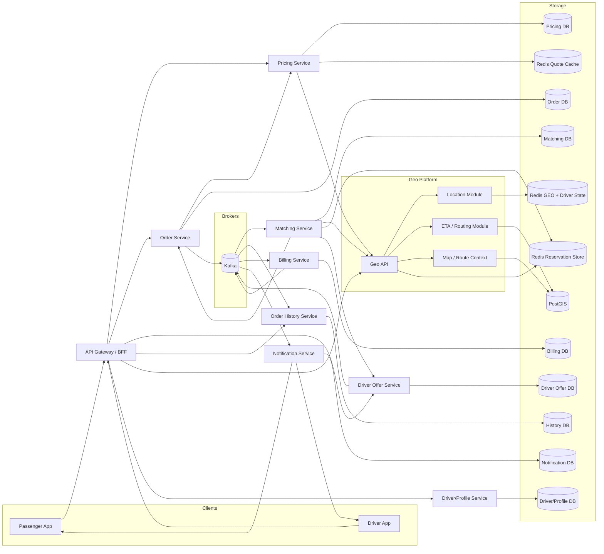
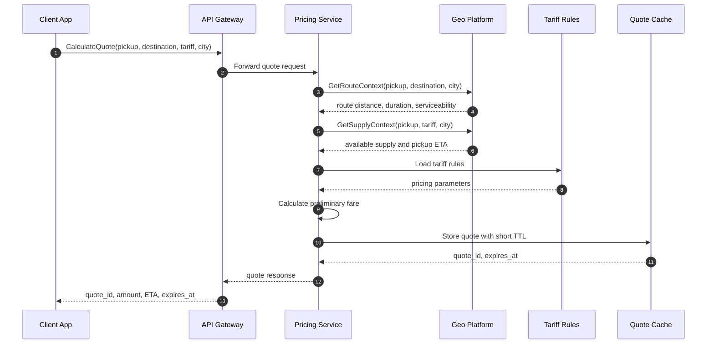
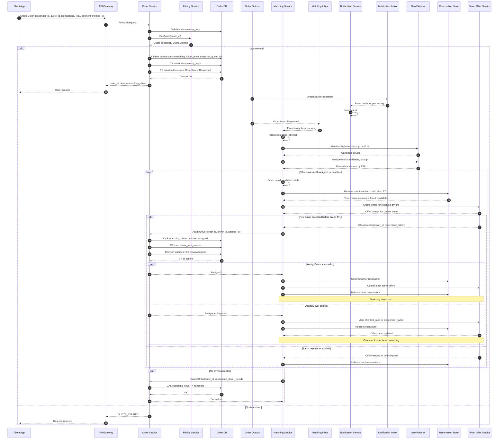
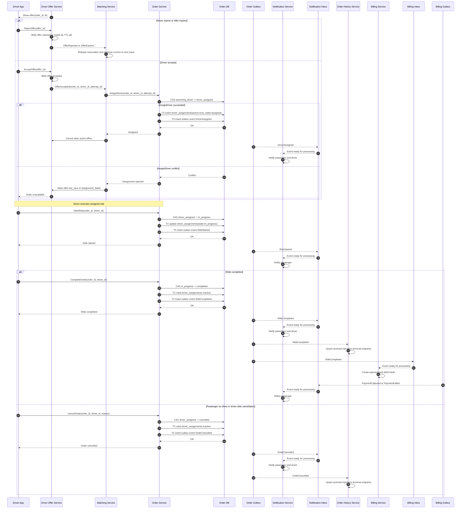
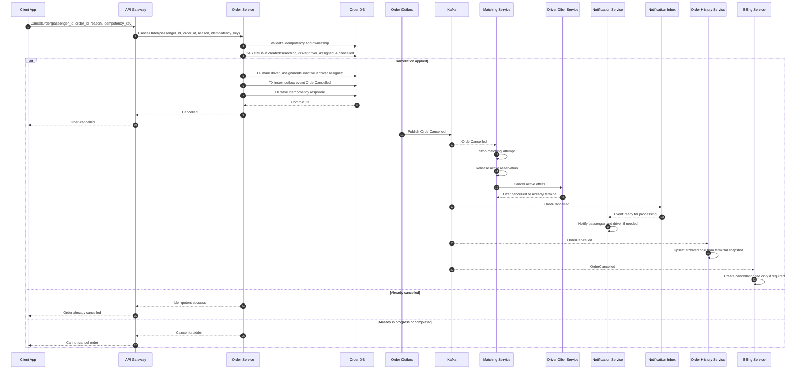
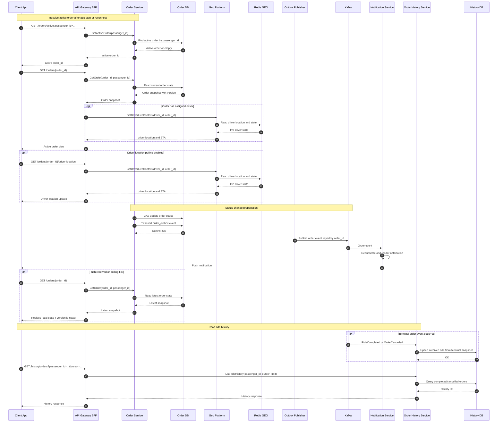
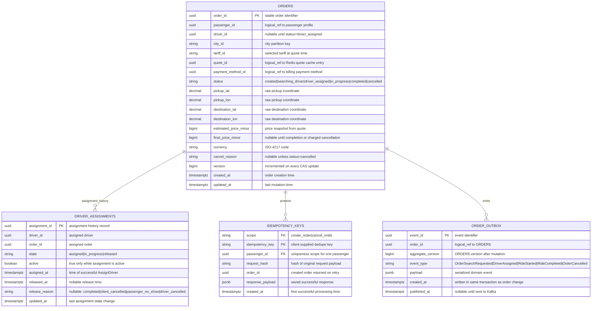
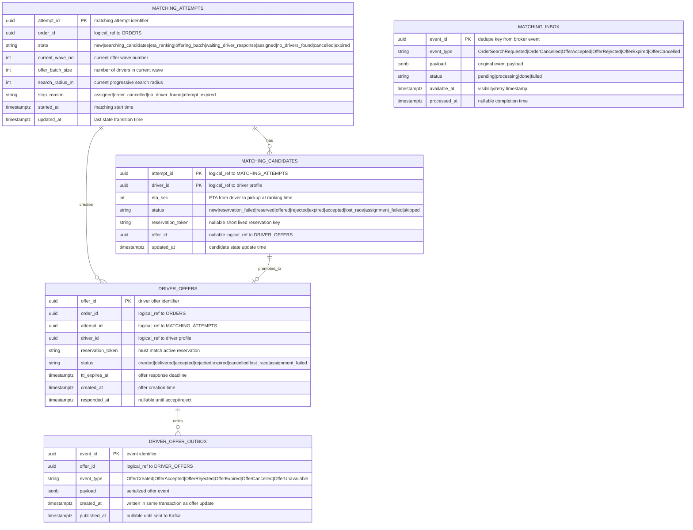

# Техническое решение проекта «Сервис заказа такси»

## Введение
**Цель проекта:**  
Необходимо спроектировать сервис заказа такси, который позволяет пассажиру создать заказ на поездку, подобрать водителя и отслеживать основные статусы заказа до завершения или отмены.

Система должна поддерживать базовый сценарий:
- пассажир указывает точку подачи и точку назначения;
- система создаёт заказ;
- система подбирает подходящего водителя;
- водитель принимает заказ;
- пассажир видит основные изменения статуса;
- поездка завершается или отменяется.

Цель проекта — предложить архитектуру highload-системы, способной обрабатывать большое количество одновременно активных заказов и быстро выполнять подбор водителя.

---

## Глоссарий
| Термин        | Определение |
|---------------|-------------|
| Заказ  | заявка пассажира на поездку |
| Пассажир | пользователь, создающий заказ |
| Водитель | пользователь системы, принимающий и выполняющий заказ |
| Matching | процесс подбора водителя для заказа |
| ETA | ожидаемое время прибытия водителя |
| Idempotency | возможность безопасно повторить запрос без создания дубликатов |
| Статус заказа | текущее состояние поездки |

---

## Функциональные требования
Система должна предоставлять следующие функции:

### Создание заказа

Система должна позволять пассажиру:
- указать точку подачи;
- указать точку назначения;
- создать заказ;
- получить предварительную оценку стоимости.

Каждый заказ должен содержать как минимум:
- order_id;
- passenger_id;
- координаты точки подачи;
- координаты точки назначения;
- время создания;
- текущий статус заказа.

### Управление статусами заказа

Система должна поддерживать как минимум следующие статусы:
- created;
- searching_driver;
- driver_assigned;
- in_progress;
- completed;
- cancelled.

### Подбор водителя

Система должна:
- находить подходящего свободного водителя поблизости;
- назначать заказ только одному водителю;
- предотвращать ситуацию, при которой один заказ одновременно назначается нескольким водителям.

### Действия водителя

Система должна позволять водителю:
- получить предложение о заказе;
- принять заказ;
- отклонить заказ.

Если водитель не принял заказ, система должна продолжить поиск другого кандидата.

### Отмена заказа

Система должна поддерживать отмену заказа:
- пассажиром;
- водителем;
- системой, если водитель не найден за допустимое время.

### История поездок

Система должна позволять пассажиру:
- просматривать список завершённых и отменённых поездок;
- получать базовую информацию о заказе: время, маршрут, статус, стоимость.

---

## Нефункциональные требования

### Нагрузка

Система должна выдерживать:
- до 2 000 новых заказов в секунду в пике;
- до 10 000 запросов в секунду на чтение и обновление активных заказов.

### Производительность

Требования к производительности:
- создание заказа — P95 не более 200 мс;
- получение ответа о назначении водителя — в типовом случае не более 10 секунд;
- чтение текущего состояния активного заказа — P95 не более 100–200 мс.

### Надёжность

Система должна обеспечивать:
- отсутствие потери активных заказов;
- корректную обработку повторных пользовательских запросов;
- устойчивость к сбоям отдельных экземпляров сервисов.

### Консистентность

Для критичных операций требуется согласованность:
- один заказ не может быть назначен нескольким водителям;
- один водитель не может одновременно выполнять несколько активных заказов.

Для истории поездок допускается eventual consistency.

### Масштабируемость

Система должна горизонтально масштабироваться по следующим контурам:
- создание и обработка заказов;
- подбор водителей;
- чтение активных заказов;
- хранение истории поездок.

---

## Архитектура системы

Основные компоненты:

1. API Gateway / BFF — единая входная точка для клиентских приложений; маршрутизирует запросы в доменные сервисы и при необходимости собирает view model для клиента.
2. Pricing Service — рассчитывает предварительную стоимость поездки, применяет тарифные правила и хранит краткоживущий quote.
3. Order Service — единственный source of truth по состоянию заказа и владелец критичных переходов статуса.
4. Matching Service — оркестрирует подбор водителя, ranking кандидатов, reservation и matching attempt.
5. Driver Offer Service — владелец офферов водителям и их TTL, но не статуса поездки.
6. Geo Platform — единый geo bounded context: зоны обслуживания, маршруты, ETA, поиск ближайших водителей и live location.
7. Order History Service — read model архива поездок; читает только терминальные события заказов и не строит состояние активной поездки.
8. Notification Service — доставка push-уведомлений пассажирам и водителям.
9. Billing Service — списание средств, возвраты и платежные статусы.

Смежные компоненты:
- Geo Platform modules: Location, ETA/Routing, Map/Route Context — логические модули внутри `Geo Platform`, а не самостоятельные bounded contexts.

**Архитектура системы:**

Условно:
- прямые стрелки между сервисами — синхронные HTTP/gRPC-вызовы;
- стрелки в `Kafka` — публикация доменных событий;
- стрелки из `Kafka` — асинхронное потребление событий;
- стрелки в `Storage` — владение или runtime-доступ к хранилищу.

## Пользовательские сценарии

### Получение предварительной стоимости

Пассажир указывает точку подачи, точку назначения и тариф. Система показывает ориентировочную стоимость поездки, примерное время в пути и примерное время ожидания машины.

### Создание заказа

Пассажир подтверждает поездку по предварительному расчету. Система создает заказ и переводит его в состояние поиска водителя. Пассажир видит, что заказ принят системой и начался подбор машины.

### Подбор и назначение водителя

Система ищет подходящего водителя рядом с точкой подачи. Водитель получает предложение о заказе и может принять или отклонить его. Если водитель принимает заказ, пассажир видит назначенного водителя и ожидаемое время подачи. Если водитель не найден, система сообщает пассажиру, что заказ не может быть выполнен.

### Исполнение поездки

После назначения водитель едет к пассажиру. Когда пассажир садится в машину, водитель начинает поездку. После прибытия в точку назначения водитель завершает поездку, а пассажир видит финальный статус и стоимость.

### Отмена заказа

Пассажир может отменить заказ до начала поездки. Водитель может отказаться от заказа или отменить его до посадки пассажира. Система уведомляет вторую сторону об отмене и освобождает заказ/водителя для дальнейшей работы.

### Просмотр состояния и истории

Пассажир может открыть активный заказ и увидеть его текущий статус. После завершения или отмены поездка становится доступна в истории поездок.

---

## Технические сценарии

### Получение предварительного расчета стоимости поездки

**Цель сценария:** быстро показать пассажиру ориентировочную стоимость поездки и примерное время подачи без создания заказа.

**Алгоритм:**
1. `Gateway` принимает запрос `CalculateQuote(pickup, destination, tariff, city, passenger_id)` и передает его в `Pricing Service`.
2. `Pricing Service` подготавливает контекст расчета.
3. `Pricing Service` запрашивает у `Geo Platform` маршрутный контекст: возможность поездки, примерную дистанцию и длительность маршрута.
4. `Pricing Service` запрашивает у `Geo Platform` supply context рядом с точкой подачи: есть ли доступные водители и какой ожидаемый ETA подачи.
5. `Pricing Service` применяет тарифные правила и считает предварительную стоимость.
6. Результат сохраняется как краткоживущий quote, чтобы `Order Service` мог использовать его при создании заказа.
7. Клиент получает `quote_id`, стоимость, валюту, примерное время поездки и срок действия quote.

Важно: quote не является заказом и не резервирует водителя. Это предварительный расчет, который может устареть из-за изменения спроса, доступности водителей или дорожной ситуации.

Сиквенс-диаграмма:

### Создание заказа пользователем

**Алгоритм:**
1. Клиент отправляет `CreateOrder(passenger_id, quote_id, idempotency_key, payment_method_id)` в `Gateway`.

Запрос не должен заново передавать цену как источник истины. Цена, маршрутный контекст и координаты берутся из `quote`, который был создан на этапе `CalculateQuote`.

2. `Gateway` проксирует команду в `Order Service.CreateOrder`.

3. `Order Service` выполняет `ValidateIdempotencyKey(scope=create_order, passenger_id, idempotency_key)`:
- если ключ уже есть и request hash совпадает, возвращает ранее сохраненный результат;
- если ключ уже есть, но request hash отличается, возвращает `IDEMPOTENCY_KEY_CONFLICT`;
- если ключа нет, продолжает создание заказа.

Идемпотентность нужна, потому что мобильный клиент может повторить запрос из-за timeout, retry или потери сети.

Для этого используется таблица `idempotency_keys` в БД `Order Service`.

Если первый запрос успешно создал заказ, повторный запрос с тем же ключом не создает новый заказ, а возвращает сохраненный `response_payload`.

4. `Order Service` вызывает `Pricing Service.GetQuote(quote_id)`:
- если quote найден и не истек, возвращается `quote snapshot`;
- если quote истек, возвращается `QUOTE_EXPIRED`;
- если quote принадлежит другому пассажиру или городу, возвращается `QUOTE_NOT_VALID`.

`Order Service` в своей БД через уникальное ограничение или lookup по `orders.quote_id`. Если по этому `quote_id` уже существует активный заказ, `Order Service` возвращает `QUOTE_ALREADY_USED`.

`quote snapshot` фиксирует:
- `pickup`, `destination`;
- `tariff_id`, `city_id`;
- `trip_distance_m`, `trip_duration_s`;
- `estimated_price_minor`, `currency`;
- `expires_at`.

5. `Order Service` открывает транзакцию в `Order DB` и создает заказ:
- генерирует `order_id`;
- вставляет строку в `orders`;
- сохраняет `price_snapshot` из quote;
- выставляет `status=searching_driver`;
- сохраняет `version=1`;
- сохраняет запись в `idempotency_keys`, чтобы повторный `CreateOrder` вернул тот же `order_id`;
- пишет `OrderSearchRequested` в `order_outbox`.

Эти действия должны быть атомарными: если заказ создан, то событие для matching тоже должно быть сохранено.

6. `Order Service` коммитит транзакцию и синхронно отвечает клиенту `order_id`, текущим статусом и зафиксированной предварительной стоимостью.

На этом синхронный путь создания заказа завершается. Подбор водителя запускается асинхронно, чтобы `CreateOrder` укладывался в низкий P95 и не ждал ETA, Redis GEO и ответы водителей.

7. `Order Outbox Publisher` читает `order_outbox` и публикует событие о необходимости подбора водителя. Если брокер временно недоступен, событие остается в outbox и будет отправлено позже.

8. `Notification Service` получает `OrderSearchRequested`:
- сохраняет событие в `notification_inbox` по `event_id`;
- дедуплицирует повторную доставку;
- отправляет пассажиру push-уведомление “Ищем водителя”.

9. `Matching Service` получает `OrderSearchRequested`:
- сохраняет событие в `matching_inbox` по `event_id`;
- если событие уже обработано, повтор игнорируется;
- worker берет событие в работу и создает `matching_attempt`.

10. `Matching Service` создает `matching_attempt`:
- `state=new`;
- `order_id`;
- `started_at`;
- `search_radius_m`;
- затем переводит state machine в `searching_candidates`.

Для одного заказа допускается только одна незавершенная `matching_attempt`.

11. `Matching Service` вызывает `Geo Platform.FindNearbyDrivers(pickup, tariff, city, N)`:
- `Geo Platform` использует геоиндекс доступных водителей;
- применяет progressive radius expansion;
- фильтрует водителей по доступности, свежести координат и активным резервациям;
- возвращает shortlist кандидатов.

12. `Matching Service` вызывает `Geo Platform.GetEtaMatrix(candidates, pickup)`:
- `Geo Platform` оценивает ETA подачи для shortlist кандидатов;
- возвращает данные, достаточные для ранжирования водителей.

13. `Matching Service` ранжирует кандидатов и сохраняет их в `matching_candidates`:

Примеры бизнес-правил:
- не предлагать заказ водителю с устаревшей координатой;
- штрафовать водителей с низкой confidence GPS;
- учитывать тариф, класс машины и локальные правила dispatch.

14. `Matching Service` разбивает ranking на небольшие волны офферов:
- например, первая волна получает 2-3 лучших кандидата;
- если никто не принял оффер до TTL, запускается следующая волна;
- общий deadline matching остается ограниченным, чтобы уложиться в рекомендуемое время назначения водителя.

Такая схема быстрее строго последовательной выдачи офферов, но не рассылает заказ всем водителям сразу.

Архитектурное решение: matching использует controlled parallel offers, то есть небольшие параллельные волны кандидатов. Это компромисс между двумя крайностями:
- строго последовательные офферы проще, но плохо укладываются в целевые 10 секунд назначения;
- массовая рассылка всем ближайшим водителям быстрее, но создает лишний шум, больше гонок и хуже контролирует user experience водителей;
- волны по 2-3 кандидата дают запас по latency, но сохраняют управляемость и позволяют завершить matching первым успешным `AssignDriver`.

15. Для каждого кандидата в текущей волне `Matching Service` пытается зарезервировать водителя:
- резервация создается как короткоживущая блокировка;
- если водитель уже зарезервирован другой попыткой, кандидат пропускается;
- если резервация взята, matching создает offer для этого водителя.

Резервация нужна, чтобы разные matching-процессы не отправили оффер одному водителю одновременно.

16. Для всех успешно зарезервированных водителей текущей волны `Matching Service` вызывает `Driver Offer Service.CreateOffer(...)`:
- `Driver Offer Service` создает offer со статусом `created`;
- создает TTL-задачу для автоматического истечения offer;
- доставляет offer в driver app;
- публикует событие `OfferCreated`.

17. Если водитель принимает оффер, `Driver Offer Service` фиксирует `OfferAccepted`.

Важно: `OfferAccepted` еще не означает, что заказ назначен. Это только заявка водителя на назначение. Финальное назначение подтверждает только `Order Service.AssignDriver`.

18. `Matching Service` на `OfferAccepted` вызывает `Order Service.AssignDriver(order_id, driver_id, attempt_id)`:
- `Order Service` открывает транзакцию;
- выполняет CAS-переход `searching_driver -> driver_assigned`;
- вставляет запись в `driver_assignments`;
- пишет `DriverAssigned` в `order_outbox`;
- коммитит транзакцию.

CAS-условие защищает заказ от гонки с клиентской отменой или другим accepted offer. `Matching Service` не обязан знать `orders.version`: командный метод `AssignDriver` внутри `Order Service` сам выполняет условное обновление по ожидаемому статусу.

Partial unique index `unique(driver_id) where active=true` дополнительно гарантирует, что один водитель не может иметь два активных заказа.

19. Если `AssignDriver` успешен:
- `Matching Service` переводит `matching_attempt.state=assigned`;
- подтверждает reservation победившего водителя;
- отменяет остальные активные offers этого заказа;
- снимает reservation с остальных водителей текущей волны;
- `Notification Service` по событию `DriverAssigned` уведомляет пассажира, что водитель найден.

20. Если `AssignDriver` неуспешен после `OfferAccepted`:
- водитель не считается назначенным;
- offer помечается как проигравший гонку или неуспешный;
- `Driver Offer Service` публикует `OfferUnavailable`;
- водитель получает сообщение, что заказ уже недоступен;
- reservation снимается;
- если заказ еще находится в поиске, matching продолжает работу со следующей волной.

Типовые причины: заказ уже отменен пассажиром, другой водитель успел назначиться раньше, offer истек, водитель уже занят другим заказом.

21. Если водитель отклоняет оффер или TTL истекает:
- `Driver Offer Service` переводит offer в `rejected` или `expired`;
- публикует `OfferRejected` или `OfferExpired`;
- `Matching Service` получает событие;
- снимает резервацию водителя;
- обновляет `matching_candidates.status`;
- после завершения текущей волны при необходимости запускает следующую волну.

22. Если кандидаты закончились или истек общий timeout matching:
- `Matching Service` переводит attempt в `no_drivers_found` или `expired`;
- вызывает `Order Service.CancelOrder(order_id, reason=no_driver_found)`;
- `Order Service` выполняет CAS-переход `searching_driver -> cancelled`;
- пишет `OrderCancelled` в `order_outbox`;
- `Notification Service` уведомляет пассажира, что водитель не найден.

23. Если клиент отменил заказ во время matching:
- `Order Service` публикует `OrderCancelled`;
- `Matching Service` получает событие через `matching_inbox`;
- останавливает `matching_attempt`;
- снимает активные reservations;
- закрывает активные offers через `Driver Offer Service`.

Сиквенс-диаграмма:

### Исполнение заказа водителем

**Алгоритм:**

1. `Driver App` получает оффер через `Driver Offer Service`.

Оффер содержит:
- `offer_id`;
- `order_id`;
- `pickup`;
- `destination`;
- `estimated_price_minor`;
- `pickup_eta`;
- `ttl_expires_at`;
- действия `AcceptOffer` и `RejectOffer`.

На этом этапе заказ еще не считается назначенным. Назначение произойдет только после успешного `AssignDriver` в `Order Service`.

2. Если водитель отклоняет оффер, `Driver App` вызывает `Driver Offer Service.RejectOffer(offer_id)`:
- `Driver Offer Service` проверяет, что оффер находится в статусе `created` или `delivered`;
- переводит `driver_offers.status` в `rejected`;
- пишет событие `OfferRejected` в `driver_offer_outbox`;
- `Matching Service` получает `OfferRejected`, снимает резервацию водителя и учитывает отказ при завершении текущей волны.

3. Если водитель не отвечает до `ttl_expires_at`, срабатывает отложенная задача `driver_offer.expire`:
- `Driver Offer Service` обрабатывает отложенную TTL-задачу;
- проверяет текущий статус оффера;
- если оффер все еще `created` или `delivered`, переводит его в `expired`;
- пишет событие `OfferExpired` в `driver_offer_outbox`;
- `Matching Service` получает `OfferExpired`, снимает reservation и при необходимости запускает следующую волну.

4. Если водитель принимает оффер, `Driver App` вызывает `Driver Offer Service.AcceptOffer(offer_id)`:
- `Driver Offer Service` проверяет, что оффер еще не истек;
- проверяет, что оффер еще не `accepted/rejected/expired/cancelled`;
- переводит `driver_offers.status` в `accepted`;
- пишет событие `OfferAccepted` в `driver_offer_outbox`.

Если `AcceptOffer` пришел после TTL, сервис возвращает `OFFER_EXPIRED`, а matching продолжает поиск в рамках текущей или следующей волны.

Важно: после нажатия “Принять” водитель еще не должен видеть поездку как окончательно назначенную. В приложении можно показать промежуточное состояние “Подтверждаем заказ”.

5. `Matching Service` получает `OfferAccepted` через `matching_inbox` и вызывает `Order Service.AssignDriver(order_id, driver_id, attempt_id)`:
- `Order Service` открывает транзакцию;
- выполняет CAS-переход `searching_driver -> driver_assigned`;
- записывает `driver_id` в `orders`;
- вставляет строку в `driver_assignments`;
- пишет `DriverAssigned` в `order_outbox`;
- коммитит транзакцию.

Если обновлено `0` строк, заказ уже мог быть отменен или назначен другим потоком. Тогда `AssignDriver` возвращает conflict, а `Matching Service` освобождает reservation.

6. Если `AssignDriver` завершился конфликтом:
- заказ не считается назначенным этому водителю;
- `Matching Service` помечает offer как `lost_race` или `assignment_failed`;
- `Driver Offer Service` публикует `OfferUnavailable`;
- водитель получает сообщение “Заказ уже недоступен” или “Пассажир отменил заказ”;
- reservation снимается;
- если заказ еще находится в поиске, matching продолжает следующую волну офферов.

Такой конфликт является штатной ситуацией при параллельных офферах: несколько водителей могут принять offer почти одновременно, но успешным будет только один `AssignDriver`.

7. После успешного `AssignDriver`:
- `Matching Service` переводит `matching_attempt.state=assigned`;
- подтверждает reservation победившего водителя;
- отменяет остальные активные offers по этому заказу;
- снимает reservation с остальных водителей;
- `Notification Service` получает `DriverAssigned` и уведомляет пассажира;
- `Driver App` начинает показывать активный заказ водителю;
- дальнейшие действия водителя идут уже не через `Driver Offer Service`, а через команды в `Order Service`.

8. Когда водитель приехал и пассажир сел в машину, `Driver App` вызывает `Order Service.StartRide(order_id, driver_id)`:
- `Order Service` проверяет, что заказ находится в `driver_assigned`;
- проверяет, что `driver_id` совпадает с назначенным водителем;
- выполняет CAS-переход `driver_assigned -> in_progress`;
- обновляет `driver_assignments.state` в `in_progress`;
- пишет `RideStarted` в `order_outbox`;
- возвращает водителю подтверждение старта поездки.

9. `Order Outbox Publisher` публикует `RideStarted` в `order.events.v1`:
- `Notification Service` уведомляет пассажира, что поездка началась;
- другие сервисы могут использовать событие для аналитики.

10. Когда водитель довез пассажира, `Driver App` вызывает `Order Service.CompleteOrder(order_id, driver_id)`:
- `Order Service` проверяет, что заказ находится в `in_progress`;
- проверяет, что команду выполняет назначенный водитель;
- фиксирует `completed_at`;
- рассчитывает или принимает финальные метрики поездки: `final_distance_m`, `final_duration_s`, `final_price_minor`;
- выполняет CAS-переход `in_progress -> completed`;
- деактивирует запись в `driver_assignments`: `active=false`, `state=released`, `released_at=now()`, `release_reason=completed`;
- пишет `RideCompleted` в `order_outbox`.

11. После публикации `RideCompleted`:
- `Billing Service` получает событие через `billing_inbox`;
- создает запись `payments` со статусом `pending`;
- выполняет списание средств;
- публикует `PaymentCaptured` или `PaymentFailed` в `billing.events.v1`;
- `Notification Service` уведомляет пассажира о завершении поездки и результате оплаты;
- `Order History Service` создает или обновляет архивную запись по полному snapshot из `RideCompleted`.

Важно: поездка уже может быть `completed`, даже если платеж позже завершился `failed`. Финансовый статус не должен откатывать статус поездки.

12. Если пассажир не сел в машину, водитель вызывает `Order Service.CancelOrder(order_id, driver_id, reason=passenger_no_show)`:
- `Order Service` разрешает такую отмену только из `driver_assigned`;
- проверяет, что отменяет назначенный водитель;
- выполняет CAS-переход `driver_assigned -> cancelled`;
- деактивирует запись в `driver_assignments`: `active=false`, `state=released`, `released_at=now()`, `release_reason=passenger_no_show`;
- пишет `OrderCancelled` в `order_outbox`;
- `Billing Service` может начислить cancellation fee, если такая политика включена;
- `Notification Service` уведомляет пассажира и водителя;
- `Order History Service` создает или обновляет архивную запись по полному snapshot из `OrderCancelled`.

13. Если водитель отменяет заказ до посадки по другой причине, используется тот же `CancelOrder`, но с другим `cancel_reason`, например `driver_cancelled`.

Такая отмена разрешена до `in_progress`. После `in_progress` обычная отмена водителем запрещена: поездку нужно завершать через `CompleteOrder` или разбирать отдельным support-flow.

Сиквенс-диаграмма:

### Отмена заказа клиентом

**Алгоритм:**
1. Клиент отправляет `CancelOrder(passenger_id, order_id, reason, idempotency_key)` в `Gateway`.

2. `Gateway` проксирует команду в `Order Service.CancelOrder`.

3. `Order Service` выполняет идемпотентность отмены:
- использует `idempotency_keys` со `scope=cancel_order`;
- если такой ключ уже обработан и request hash совпадает, возвращает сохраненный `response_payload`;
- если ключ уже есть, но request hash отличается, возвращает `IDEMPOTENCY_KEY_CONFLICT`;
- если ключа нет, продолжает выполнение.

Идемпотентность нужна, потому что клиент почти наверняка будет ретраить отмену при плохой сети. Без нее можно получить несколько разных ответов на одну пользовательскую команду.

4. `Order Service` читает заказ из `Order DB` и проверяет, что пассажир имеет право отменить этот заказ.

5. `Order Service` проверяет допустимость перехода:
- `created -> cancelled` разрешен;
- `searching_driver -> cancelled` разрешен;
- `driver_assigned -> cancelled` разрешен, но нужно уведомить назначенного водителя и освободить assignment;
- `in_progress -> cancelled` запрещен для клиента, потому что поездка уже началась;
- `completed -> cancelled` запрещен;
- `cancelled -> cancelled` возвращается как идемпотентный успех.

6. `Order Service` выполняет CAS-переход в одной транзакции:
- условно обновляет заказ только если текущий статус входит в `created/searching_driver/driver_assigned`;
- выставляет `status=cancelled`;
- выставляет `cancel_reason=client_cancelled` или более конкретную причину клиента;
- увеличивает `orders.version`;
- если у заказа был назначенный водитель, деактивирует `driver_assignments`;
- пишет `OrderCancelled` в `order_outbox` с `aggregate_version = orders.version`;
- сохраняет результат в `idempotency_keys`.

Если `driver_id IS NOT NULL`, в той же транзакции закрывается активное назначение:

Важно: запись в `driver_assignments` не удаляется. Она остается историей факта, что водитель был назначен, но assignment был освобожден из-за отмены клиентом.

7. Если CAS обновил `0` строк, `Order Service` перечитывает текущий статус:
- если статус уже `cancelled`, возвращает идемпотентный успех;
- если статус `in_progress`, возвращает `CANCEL_FORBIDDEN_RIDE_IN_PROGRESS`;
- если статус `completed`, возвращает `CANCEL_FORBIDDEN_RIDE_COMPLETED`;
- если заказа нет, возвращает `ORDER_NOT_FOUND`.

9. `Order Outbox Publisher` публикует `OrderCancelled` в `order.events.v1`.

Событие должно содержать snapshot, достаточный для подписчиков:
- `order_id`;
- `passenger_id`;
- `driver_id`, если водитель был назначен;
- `previous_status`;
- `cancel_reason`;
- `cancelled_by=passenger`;
- `pickup`, `destination`;
- `estimated_price_minor`, `final_price_minor`, если есть cancellation fee;
- `aggregate_version`.

10. `Matching Service` получает `OrderCancelled` через `matching_inbox` и идемпотентно останавливает matching:
- находит активный `matching_attempt` по `order_id`;
- если attempt уже в terminal state, ничего не меняет;
- переводит `matching_attempt.state=cancelled`;
- выставляет `stop_reason=order_cancelled`;
- снимает активный Redis reservation по `reservation_token`;
- помечает текущего кандидата как `skipped` или `expired`, если оффер уже был неактуален;
- вызывает `Driver Offer Service.CancelOffers(order_id, reason=order_cancelled)` для активных офферов.

11. `Driver Offer Service` закрывает активные офферы:
- выполняет CAS `driver_offers.status IN ('created', 'delivered') -> cancelled`;
- если оффер уже `rejected/expired/cancelled`, операция считается идемпотентной;
- если оффер уже `accepted`, `Driver Offer Service` не решает судьбу заказа сам: итоговый source of truth все равно `Order Service`;
- публикует `OfferCancelled`, чтобы приложение водителя убрало оффер с экрана.

12. Если отмена произошла после `driver_assigned`:
- `Order Service` уже деактивировал `driver_assignments`;
- водитель больше не считается занятым активным заказом;
- runtime-состояние водителя можно вернуть в `available`, если у него нет другого активного assignment;
- `Notification Service` отправляет водителю пуш “Заказ отменен пассажиром”.

13. Если гонка произошла одновременно с принятием оффера водителем:
- `Driver Offer Service` может успеть опубликовать `OfferAccepted`;
- `Matching Service` попробует вызвать `AssignDriver`;
- `Order Service.AssignDriver` выполнит CAS `searching_driver -> driver_assigned`;
- так как заказ уже `cancelled`, CAS обновит `0` строк;
- `Matching Service` освободит reservation и завершит attempt как `order_cancelled`.

За счет этого заказ не может снова стать `driver_assigned` после клиентской отмены.

14. `Notification Service` получает `OrderCancelled`:
- пассажиру отправляет подтверждение отмены;
- водителю отправляет уведомление только если был `driver_id` или активный offer;
- клиент обновит активный экран после push-уведомления или через очередной polling `GET /orders/{order_id}`.

15. `Order History Service` получает `OrderCancelled`:
- создает или обновляет архивную запись только по терминальному событию;
- сохраняет `status=cancelled`, `finished_at`, `cancel_reason`;
- сохраняет маршрут, стоимость и `driver_id`, если они есть в terminal snapshot события.

16. `Billing Service` получает `OrderCancelled`:
- если отмена бесплатная, платеж не создается;
- если политика тарифа предусматривает cancellation fee, создает `payments` на сумму штрафа;
- публикует `PaymentCaptured` или `PaymentFailed`;
- статус заказа при этом не откатывается из `cancelled`.

Сиквенс-диаграмма:

### Просмотр состояния заказа

В этом сценарии важно разделить два разных read path:
- активный заказ читается из `Order Service`, потому что это source of truth;
- архив поездок читается из `Order History Service`, потому что это eventually consistent read model.

Активный экран = Order Service
Архив завершенных и отмененных поездок = Order History Service.

Архитектурное решение: `Order History Service` не читает нетерминальные события заказа для построения пользовательской истории. Он обрабатывает только `RideCompleted` и `OrderCancelled`, потому что его задача — снять read-нагрузку архива с `Order Service`, а не дублировать состояние активной поездки.

Следствие: терминальные события должны содержать полный snapshot, достаточный для записи истории. Если `RideCompleted` или `OrderCancelled` не несут всех нужных полей, `Order History Service` может дозагрузить snapshot из `Order Service`, но это fallback, а не основной happy path.

**Алгоритм просмотра активного заказа:**
1. После `CreateOrder` клиент получает `order_id` и открывает экран активного заказа.

2. `Client App` сохраняет `active_order_id` локально:
- в памяти приложения для текущей сессии;
- в persistent storage приложения, чтобы пережить перезапуск;
- вместе с последним известным `status` и `version`.

3. При открытии приложения, реконнекте или возврате на экран клиент определяет актуальный `order_id`:
- сначала берет `active_order_id` из локального состояния;
- затем вызывает `GET /orders/active?passenger_id=...`;
- `Order Service` возвращает активный заказ пассажира, если он есть;
- если локальный `active_order_id` отличается от ответа сервера, клиент доверяет серверу;
- если активного заказа нет, клиент очищает локальный `active_order_id`.

Так мы не зависим от того, сохранился ли `order_id` в памяти мобильного приложения после реконнекта.

4. Сразу после открытия экрана клиент делает initial read:

5. `Gateway/BFF` проксирует запрос в `Order Service.GetOrder(order_id, passenger_id)`.

6. `Order Service` читает `orders` из `Order DB`, проверяет доступ к заказу и возвращает текущий status snapshot из source of truth.

7. Если заказ уже в `driver_assigned` или `in_progress`, `Gateway/BFF` может дополнительно собрать view model для экрана:
- получить live координату водителя из `Geo Platform`;
- получить актуальный ETA `driver -> pickup` или `driver -> destination` из `Geo Platform`;
- вернуть клиенту обогащенный payload.

Важно: это обогащение не меняет источник истины по статусу заказа. Статус все равно берется из `Order Service`.

8. Если приложению нужно обновлять live координату водителя, клиент периодически вызывает:

`Gateway/BFF` внутри вызывает `Geo Platform.GetDriverLiveContext(driver_id, order_id)`.

Это отдельный lightweight polling для карты. Он не трогает `Order Service`, кроме проверки доступа к заказу.

9. Когда `Order Service` меняет статус заказа, он в той же транзакции пишет событие в `order_outbox`:
- `OrderSearchRequested`;
- `DriverAssigned`;
- `RideStarted`;
- `RideCompleted`;
- `OrderCancelled`.

10. `Order Outbox Publisher` публикует событие об изменении заказа. Событие содержит версию заказа, чтобы подписчики не применяли устаревшие изменения.

11. `Notification Service` получает событие и отправляет клиенту push notification:
- “Ищем водителя”;
- “Водитель найден”;
- “Поездка началась”;
- “Поездка завершена”;
- “Заказ отменен”.

Push только сигнализирует клиенту, что стоит перечитать состояние заказа из `Order Service`.

12. После получения push или при периодическом polling клиент вызывает:

13. `Order Service` возвращает актуальный snapshot заказа из `Order DB`.

14. Клиент применяет новый snapshot только если версия новее локальной:

Это защищает UI от повторных push-уведомлений, задержек сети и старых ответов после retry.

15. Если push не дошел, приложение все равно обновится через polling:
- активный экран может опрашивать `GET /orders/{order_id}` раз в несколько секунд;
- частоту polling можно снижать, если приложение в background;
- при возврате приложения в foreground клиент всегда делает `GET /orders/active`.

16. Если статус стал `completed` или `cancelled`:
- активный экран показывает финальное состояние;
- клиент может закрыть экран активной поездки;
- в архиве поездка появится после того, как `Order History Service` обработает терминальное событие;
- если пользователь сразу открыл историю и записи еще нет, UI может показать “история обновляется” или временно взять финальный snapshot из `Order Service`.

**Алгоритм просмотра истории поездок:**
1. Клиент открывает экран истории поездок.

2. `Client App` вызывает:

3. `Gateway/BFF` проксирует запрос в `Order History Service`.

4. `Order History Service` читает `ride_history` из своей БД:
- фильтр `passenger_id`;
- только терминальные статусы `completed/cancelled`;
- сортировка по `finished_at DESC`;
- pagination через cursor.

Как работает cursor pagination:
- первая страница запрашивается без cursor;
- сервис возвращает ограниченный список поездок и opaque `next_cursor`, если есть следующая страница;
- cursor строится по стабильной сортировке, например по времени завершения поездки и идентификатору заказа;
- клиент не интерпретирует cursor, а просто передает его в следующий запрос;
- такой подход лучше постраничного чтения со смещением для больших историй, потому что чтение продолжается от последней видимой записи.

5. `Order History Service` возвращает список поездок:
- `order_id`;
- `status`;
- `pickup`, `destination`;
- `created_at`, `started_at`, `finished_at`;
- `estimated_price_minor`, `final_price_minor`;
- `currency`;
- `driver_id`, если был назначен;
- `cancel_reason`, если заказ отменен.

6. Если пользователь открывает конкретную историческую поездку:
- базовые данные читаются из `Order History Service`;
- платежные детали при необходимости можно дозагрузить из `Billing Service`;
- подробный маршрут можно дозагрузить из `Geo Platform` или хранить в `ride_history` как route snapshot.

Что именно делает `Order History Service`:
- на `RideCompleted` создает или обновляет `ride_history` со статусом `completed`;
- на `OrderCancelled` создает или обновляет `ride_history` со статусом `cancelled`;
- на платежные события может обновлять платежные поля истории, если продукт хочет показывать результат оплаты в архиве.

Что должно быть в terminal snapshot:
- идентификаторы заказа, пассажира, водителя, города и тарифа;
- координаты или адреса подачи и назначения;
- предварительная и финальная стоимость;
- валюта;
- времена создания, назначения, старта, завершения или отмены;
- финальная дистанция и длительность, если поездка завершена;
- причина отмены, если заказ отменен.

Почему history не читает `DriverAssigned` и `RideStarted`:
- активная поездка читается из `Order Service`;
- история не должна становиться вторым источником истины по активному заказу;
- исчезает риск перетереть терминальный архив промежуточным событием, пришедшим поздно;
- модель истории становится проще: запись появляется только после завершения или отмены.

Важно: `Order History Service` не является источником истины для активной поездки. Он строит архивную read model из терминальных событий и может отставать на секунды, поэтому активный экран читает `Order Service`.

Сиквенс-диаграмма:

---

## Модель данных

Общие правила:
- связи между таблицами разных сервисов следует читать как `logical_ref`, а не как физические `FK`;
- все денежные значения хранятся в `minor units`;
- все критичные переходы статусов в `Order Service` и `Matching Service` выполняются через `CAS` / optimistic locking;
- `Redis` используется только для краткоживущего и high-frequency состояния, а `PostgreSQL` остается источником истины.

### Order Core

`orders.status`
- `created` — заказ создан, quote зафиксирован, matching еще не активирован или только запускается.
- `searching_driver` — идет подбор водителя.
- `driver_assigned` — водитель назначен, но поездка не началась.
- `in_progress` — пассажир в машине, поездка выполняется.
- `completed` — поездка успешно завершена.
- `cancelled` — заказ отменен пользователем, водителем или системой.

`driver_assignments.state`
- `assigned` — водитель назначен, но поездка еще не началась.
- `in_progress` — водитель выполняет поездку.
- `released` — назначение завершено, водитель больше не занят этим заказом.

Ограничения блока:
- для одного пассажира допускается не более одного активного заказа в статусах `created/searching_driver/driver_assigned/in_progress`;
- `driver_id` должен быть `NULL`, пока заказ не достиг `driver_assigned`;
- таблица `driver_assignments` хранит историю назначений и не удаляет записи после завершения поездки;
- активное назначение помечается `active=true`, завершенное назначение — `active=false`, `state=released`, `released_at` и `release_reason`;
- инвариант “один водитель -> не более одного активного заказа” задается partial unique index: `unique(driver_id) where active=true`;
- инвариант “один заказ -> не более одного активного водителя” задается partial unique index: `unique(order_id) where active=true`;
- запись в `driver_assignments` создается при `AssignDriver`, обновляется при `StartRide`, деактивируется при `CompleteOrder` и `CancelOrder`;
- `cancel_reason` обязателен только для `status=cancelled`;
- `final_price_minor` должен оставаться `NULL` до завершения поездки или chargeable cancellation;
- каждая запись в `order_outbox` создается в той же транзакции, что и изменение `orders`;
- `order_outbox.aggregate_version` равен новому значению `orders.version` и нужен consumers для защиты read model от устаревших событий.

### Matching & Driver Offer

`matching_attempts.state`
- `new` — попытка создана.
- `searching_candidates` — идет поиск nearby drivers.
- `eta_ranking` — считается ETA и строится ranking.
- `offering_batch` — создается волна офферов для нескольких кандидатов.
- `waiting_driver_response` — офферы текущей волны отправлены, система ждет ответы.
- `assigned` — один из accepted offers успешно подтвержден через `AssignDriver`.
- `no_drivers_found` — кандидаты исчерпаны.
- `cancelled` — попытка остановлена из-за отмены заказа.
- `expired` — попытка завершилась по таймауту/политике.

`matching_candidates.status`
- `new` — кандидат найден, но еще не обработан.
- `reservation_failed` — водитель уже зарезервирован другим matching.
- `reserved` — lock на водителя успешно взят.
- `offered` — оффер создан и отправлен водителю.
- `rejected` — водитель отказался.
- `expired` — TTL оффера истек.
- `accepted` — водитель принял оффер.
- `lost_race` — водитель принял offer, но заказ уже был назначен другому водителю.
- `assignment_failed` — водитель принял offer, но `AssignDriver` не подтвердил назначение по другой причине.
- `skipped` — кандидат осознанно пропущен.

`driver_offers.status`
- `created` — запись об оффере создана.
- `delivered` — оффер доставлен в driver app.
- `accepted` — оффер принят в TTL-окне, но еще не обязательно стал назначением.
- `rejected` — оффер отклонен.
- `expired` — водитель не ответил вовремя.
- `cancelled` — оффер потерял актуальность из-за остановки matching или отмены заказа.
- `lost_race` — водитель принял offer, но другой водитель был назначен раньше.
- `assignment_failed` — offer принят, но назначение не подтверждено `Order Service`.

`OfferUnavailable` публикуется, когда водитель уже принял offer, но итоговый `AssignDriver` не подтвердил назначение. Это событие нужно, чтобы driver app убрал промежуточное состояние “Подтверждаем заказ” и показал водителю, что заказ больше недоступен.

Ограничения блока:
- для одного заказа допускается не более одной незавершенной `matching_attempt`;
- один водитель может иметь только одну активную `reservation` в Redis одновременно;
- `AssignDriver` допустим только если `orders.status=searching_driver`;
- один matching attempt может иметь несколько активных offers в рамках текущей волны;
- успешным назначением считается только `DriverAssigned`, а не `OfferAccepted`;
- статусы кандидата и оффера могут двигаться только вперед, без возврата назад;
- все `*_inbox` таблицы обрабатываются идемпотентно по `event_id`.

### Pricing & Geo

`Pricing Service` отвечает за правила расчета предварительной стоимости: тариф, город, базовая цена, компоненты стоимости и срок действия quote.

`Geo Platform` отвечает за географический контекст:
- проверку доступности зоны поездки;
- расчет маршрутных метрик для quote;
- поиск ближайших доступных водителей;
- оценку ETA подачи;
- предоставление live location водителя для активного заказа.

Детали хранения дорожного графа, алгоритмов маршрутизации и структуры геоиндексов являются внутренней реализацией `Geo Platform` и не фиксируются в технических требованиях.

### History, Billing & Notification

```mermaid
erDiagram
    RIDE_HISTORY {
        uuid order_id PK "same id as in ORDERS"
        uuid passenger_id "logical_ref to passenger profile"
        uuid driver_id "nullable if driver was not assigned"
        string city_id "city partition key"
        string tariff_id "tariff used for ride"
        string status "completed|cancelled"
        decimal pickup_lat "pickup coordinate"
        decimal pickup_lon "pickup coordinate"
        decimal destination_lat "destination coordinate"
        decimal destination_lon "destination coordinate"
        bigint estimated_price_minor "quote snapshot"
        bigint final_price_minor "nullable if free cancellation"
        int trip_distance_m "nullable until route finalization"
        int trip_duration_s "nullable until route finalization"
        string currency "ISO-4217 code"
        string cancel_reason "nullable unless cancelled"
        bigint source_order_version "terminal ORDERS.version"
        timestamptz created_at "order creation time"
        timestamptz started_at "nullable ride start time"
        timestamptz finished_at "completion or cancellation time"
        timestamptz updated_at "last read model update time"
    }

    HISTORY_INBOX {
        uuid event_id PK "dedupe key from broker event"
        string event_type "RideCompleted|OrderCancelled|PaymentCaptured|PaymentFailed"
        bigint aggregate_version "source aggregate version"
        jsonb payload "source event payload"
        string status "pending|processing|done|failed"
        timestamptz processed_at "nullable completion time"
    }

    PAYMENTS {
        uuid payment_id PK "payment identifier"
        uuid order_id "logical_ref to ORDERS"
        uuid passenger_id "logical_ref to passenger profile"
        uuid payment_method_id "logical_ref to billing payment method"
        bigint amount_minor "captured or attempted amount"
        string currency "ISO-4217 code"
        string status "pending|captured|failed|refunded"
        timestamptz created_at "payment creation time"
        timestamptz updated_at "last payment status change"
    }

    BILLING_INBOX {
        uuid event_id PK "dedupe key from broker event"
        string event_type "RideCompleted|OrderCancelled"
        jsonb payload "source event payload"
        string status "pending|processing|done|failed"
        timestamptz processed_at "nullable completion time"
    }

    BILLING_OUTBOX {
        uuid event_id PK "event identifier"
        uuid payment_id "logical_ref to PAYMENTS"
        string event_type "PaymentCaptured|PaymentFailed|RefundIssued"
        jsonb payload "serialized payment event"
        timestamptz created_at "written in same transaction as payment change"
        timestamptz published_at "nullable until sent to Kafka"
    }

    NOTIFICATION_INBOX {
        uuid event_id PK "dedupe key from broker event"
        string event_type "order, offer or billing event"
        jsonb payload "source event payload"
        string status "pending|processing|done|failed"
        timestamptz processed_at "nullable completion time"
    }

    NOTIFICATION_DELIVERIES {
        uuid notification_id PK "notification attempt identifier"
        uuid user_id "logical_ref to recipient"
        string channel "push|email"
        string message "notification message"
        string status "pending|sent|failed"
        timestamptz created_at "creation time"
        timestamptz sent_at "nullable delivery attempt time"
    }

    PAYMENTS ||--o{ BILLING_OUTBOX : emits
```

Назначение блока:
- `ride_history` — eventually consistent read model архива поездок; запись создается или обновляется по терминальным событиям `RideCompleted` и `OrderCancelled`;
- `payments` — финансовый lifecycle списания;
- `notification_deliveries` — доставка пользовательских уведомлений.

Ограничения блока:
- `ride_history` не хранит активные статусы `driver_assigned` и `in_progress`;
- `ride_history.source_order_version` хранит версию терминального snapshot заказа;
- для cursor pagination истории нужен индекс, соответствующий фильтру пассажира и сортировке по времени завершения;
- `history_inbox.event_id` защищает от повторной доставки того же события;
- стандартный `payment capture` запускается после `RideCompleted`, а не в момент `CreateOrder`;
- заказ может стать `completed`, даже если платеж позже перейдет в `failed`;
- отправка уведомлений строится по модели at-least-once, поэтому дедупликация должна происходить на стороне `notification_inbox` или `notification_deliveries`.

### Runtime-хранилища

Redis используется только для краткоживущего и часто обновляемого состояния, которое не должно нагружать PostgreSQL:
- предварительные quote с коротким сроком действия;
- актуальные координаты и доступность водителей;
- heartbeat/last seen водителей;
- краткоживущие reservation на этапе matching.

PostgreSQL остается источником истины для заказов, назначений, офферов, платежей и истории. Потеря Redis-состояния не должна приводить к потере заказа: система должна уметь восстановить каноническое состояние из PostgreSQL и событий.

---

## Событийное взаимодействие

События используются для асинхронной связи между сервисами и для построения read model.

Основные принципы:
- критичные изменения состояния сначала фиксируются в БД сервиса-владельца;
- событие записывается в outbox в той же транзакции;
- outbox publisher публикует событие в брокер;
- consumers обрабатывают события идемпотентно;
- порядок событий одного заказа сохраняется по ключу `order_id`;
- consumers читают только те события, которые входят в их зону ответственности.

Основные группы событий:
- события заказа: создание, назначение водителя, старт поездки, завершение, отмена;
- события оффера водителю: создан, принят, отклонен, истек, отменен, стал недоступен после неуспешного назначения;
- финансовые события: платеж успешно списан, платеж не прошел, выполнен возврат.

Эти события потребляют `Matching Service`, `Order History Service`, `Notification Service` и `Billing Service` в зависимости от своей зоны ответственности. В частности, `Order History Service` потребляет только терминальные события заказа: `RideCompleted` и `OrderCancelled`.

---

## Соответствие функциональным / нефункциональным требованиям

### Функциональные требования

1. Создание заказа пассажиром поддержано:
- `Pricing Service.CalculateQuote` считает предварительную стоимость;
- `Order Service.CreateOrder` создает заказ по `quote_id`;
- `orders` хранит `order_id`, `passenger_id`, координаты, цену, статус и время создания;
- `OrderSearchRequested` запускает асинхронный подбор водителя.

2. Управление статусами заказа поддержано:
- статусная модель: `created`, `searching_driver`, `driver_assigned`, `in_progress`, `completed`, `cancelled`;
- все переходы выполняются через методы `AssignDriver`, `StartRide`, `CompleteOrder`, `CancelOrder`;
- критичные переходы защищены CAS-обновлениями в `Order Service`.

3. Подбор водителя поддержан:
- `Matching Service` оркестрирует matching attempt;
- `Geo Platform` ищет ближайших доступных водителей;
- ETA и маршрутные метрики предоставляет `Geo Platform`;
- `Driver Offer Service` создает offer с TTL;
- offers могут отправляться небольшими волнами, чтобы уложиться в рекомендуемое время назначения;
- если волна не дала успешного назначения, matching переходит к следующей волне кандидатов.

4. Действия водителя поддержаны:
- водитель получает offer через `Driver Offer Service`;
- `AcceptOffer` и `RejectOffer` фиксируются в `driver_offers`;
- `OfferAccepted`, `OfferRejected`, `OfferExpired`, `OfferCancelled`, `OfferUnavailable` публикуются в Kafka;
- `OfferAccepted` не является финальным назначением; назначение подтверждается только событием `DriverAssigned`;
- после назначения водитель управляет поездкой через `Order Service.StartRide` и `Order Service.CompleteOrder`.

5. Отмена заказа поддержана:
- клиент может отменить заказ до `in_progress`;
- водитель может отменить заказ до посадки пассажира;
- система может отменить заказ с причиной `no_driver_found`;
- все отмены приводят к `OrderCancelled`, уведомлениям и записи в архив истории.

6. История поездок поддержана:
- `Order History Service` строит `ride_history` только из терминальных событий заказа;
- история хранит завершенные и отмененные поездки;
- чтение истории идет через cursor pagination;
- для истории допускается eventual consistency.

### Производительность

1. До 2000 новых заказов/сек:
- синхронный путь `CreateOrder` короткий: `Gateway -> Order Service -> Pricing.GetQuote -> Order DB transaction`;
- matching не выполняется в синхронном запросе создания заказа;
- запуск matching идет через `order_outbox` и Kafka;
- запись заказа и outbox-события выполняется одной транзакцией.

2. Создание заказа P95 <= 200 ms:
- `Order Service` не строит маршруты и не считает ETA на этапе `CreateOrder`;
- цена и route context уже подготовлены в `quote`;
- `CreateOrder` делает только проверку quote, idempotency и короткую транзакцию.

3. Чтение активного заказа P95 <= 100-200 ms:
- активный заказ читается напрямую из `Order Service`;
- read path не зависит от `Order History Service`;
- `GET /orders/{order_id}` читает компактную строку из `orders`;
- дополнительные данные вроде координаты водителя и ETA можно получать отдельно через `Geo Platform`;
- обновления активных заказов остаются короткими CAS-update по `order_id` и требуют индексов/партиционирования при росте объема.

4. Назначение водителя в типовом случае <= 10 секунд:
- геоиндекс быстро дает shortlist ближайших водителей;
- ETA считается только для ограниченного числа кандидатов;
- offers отправляются небольшими параллельными волнами;
- offer TTL остается достаточно коротким, чтобы успеть попробовать несколько волн;
- первый успешный `AssignDriver` завершает matching, остальные offers отменяются.

### Надежность

1. Отсутствие потери активных заказов:
- source of truth по заказу — PostgreSQL в `Order Service`;
- создание заказа и запись `OrderSearchRequested` в outbox выполняются атомарно;
- если Kafka временно недоступна, событие остается в outbox и будет опубликовано позже.

2. Корректная обработка повторных пользовательских запросов:
- `idempotency_keys` защищает `CreateOrder` и `CancelOrder`;
- повторный запрос с тем же ключом возвращает сохраненный результат;
- конфликтующий payload с тем же idempotency key возвращает `IDEMPOTENCY_KEY_CONFLICT`.

3. Устойчивость к сбоям отдельных экземпляров сервисов:
- сервисы stateless относительно процесса и могут перезапускаться;
- состояние хранится в PostgreSQL, Redis, Kafka, outbox/inbox;
- inbox consumers обрабатывают события идемпотентно по `event_id`;
- failed events могут ретраиться через inbox/pgqueue.

4. Устойчивость к повторной доставке событий:
- Kafka consumers работают в модели at-least-once;
- `event_id` используется для дедупликации;
- terminal snapshot в `RideCompleted` и `OrderCancelled` позволяет history consumer быть идемпотентным и не собирать состояние из промежуточных событий.

### Консистентность

1. Один заказ не может быть назначен нескольким водителям:
- `Order Service.AssignDriver` делает CAS `searching_driver -> driver_assigned`;
- если заказ уже отменен или назначен, CAS обновит `0` строк;
- partial unique index `unique(order_id) where active=true` в `driver_assignments` дополнительно защищает инвариант.

2. Один водитель не может одновременно выполнять несколько активных заказов:
- Redis reservation снижает вероятность двойного offer одному водителю;
- финальная гарантия задается в PostgreSQL через `driver_assignments`;
- partial unique index `unique(driver_id) where active=true` запрещает две активные поездки у одного водителя;
- записи `driver_assignments` не удаляются, а деактивируются через `active=false`.

3. История поездок eventually consistent:
- `Order History Service` не участвует в критичном write path;
- `ride_history` строится из терминальных событий `RideCompleted` и `OrderCancelled`;
- терминальные события содержат полный snapshot, достаточный для записи истории;
- активный экран всегда читает `Order Service`, а не history read model.

4. Финансовый статус не откатывает статус поездки:
- `RideCompleted` переводит заказ в `completed`;
- `PaymentFailed` фиксирует проблему оплаты, но не возвращает заказ из `completed`;
- финансовые события живут в `billing.events.v1`.

### Масштабируемость

1. Создание и обработка заказов:
- `Order Service` масштабируется горизонтально;
- нагрузка на запись распределяется по short transactions;
- outbox workers можно масштабировать отдельно.

2. Подбор водителей:
- `Matching Service` масштабируется по партициям брокера и числу фоновых воркеров;
- поиск ближайших вынесен в Redis GEO;
- ETA считается только для shortlist, а не для всех водителей.

3. Чтение активных заказов:
- основной read path идет в `Order Service`;
- можно добавить read replicas или cache для read-heavy endpoint-ов, если появится необходимость;
- координаты водителя читаются отдельно из Geo Platform/Redis.

4. Хранение истории поездок:
- `Order History Service` отделен от `Order Service`;
- история читается из отдельной БД;
- cursor pagination лучше подходит для больших объемов истории, чем чтение со смещением.

5. Уведомления и биллинг:
- `Notification Service` и `Billing Service` потребляют события асинхронно;
- их деградация не блокирует создание заказа, matching и завершение поездки;
- ошибки доставки уведомлений и платежей обрабатываются через inbox/retry.

6. Масштабирование PostgreSQL:
- использовать отдельную БД на bounded context: `Order DB`, `Matching DB`, `Driver Offer DB`, `History DB`, `Billing DB`;
- добавить connection pooling через `PgBouncer`, чтобы всплески traffic не создавали слишком много соединений к PostgreSQL;
- для read-heavy endpoint-ов добавить read replicas, например для `GetOrder`, `GetActiveOrder`, `ListRideHistory`;
- для больших таблиц использовать partitioning:
  - `orders` можно партиционировать по `created_at` или `city_id + created_at`;
  - `ride_history` — по `passenger_id hash` или по времени `finished_at`;
  - `order_outbox` / inbox-таблицы — по `created_at`, чтобы быстро чистить старые события;
- горячие индексы держать узкими и привязанными к основным read/write path.

7. Масштабирование Redis:
- driver geo/state можно разделять по городу, тарифу и при необходимости по геоячейкам;
- использовать Redis Cluster, если один Redis node перестает держать объем GEO/state/heartbeat операций;
- reservation keys остаются короткоживущими через `EX`, чтобы Redis сам очищал устаревшие блокировки;
- для quote cache достаточно TTL и горизонтального Redis/cluster, потому что quote можно пересчитать.

8. Масштабирование брокера и очередей:
- события партиционируются по ключу бизнес-агрегата, чтобы сохранить порядок внутри одного заказа;
- consumer groups позволяют независимо масштабировать `Matching Service`, `Order History Service`, `Notification Service`, `Billing Service`;
- outbox publishers можно масштабировать несколькими воркерами при условии безопасного конкурентного выбора задач;
- inbox/queue workers масштабируются горизонтально, потому что обработка идемпотентна.

9. Масштабирование Geo Platform:
- геоданные и routing-хранилище можно держать отдельно от transactional БД заказов;
- тяжелые read-only операции маршрутов и ETA можно выносить на отдельные реплики или специализированный routing-контур;
- данные можно разделять по городу или региону;
- часто используемые маршрутные результаты можно кешировать коротким TTL;
- статическую карту лучше отдавать через подготовленные tiles, чтобы не смешивать рендеринг карты и расчет маршрутов.

10. Масштабирование active read path:
- `GET /orders/{order_id}` должен читать минимальный snapshot заказа;
- live driver location читается отдельно из Redis/Geo Platform;
- push notification только сигнализирует клиенту перечитать состояние, поэтому Notification Service не становится source of truth;
- при росте RPS можно добавить read replica или cache для active order snapshot, но CAS-write path остается в primary `Order DB`.

## Компромиссы и ограничения решения

1. История поездок обновляется асинхронно:
- активное состояние заказа доступно сразу через `Order Service`;
- запись в истории появляется только после терминального события `RideCompleted` или `OrderCancelled` и может появиться с задержкой;
- это снижает нагрузку на критичный write path, но требует учитывать eventual consistency в UI.

2. Order History Service не показывает активные поездки:
- сервис истории специально не читает `DriverAssigned` и `RideStarted`;
- это упрощает read model и не создает второй источник истины для активного заказа;
- цена компромисса в том, что экран активной поездки всегда должен обращаться к `Order Service`.

3. Redis используется только как runtime-хранилище:
- координаты, heartbeat и reservation водителей хранятся в Redis ради скорости;
- потеря Redis-состояния не должна приводить к потере заказа;
- строгие инварианты назначения водителя фиксируются в PostgreSQL.

4. Подбор водителя является асинхронным процессом:
- создание заказа не ждет ответа водителей;
- это помогает уложиться в latency создания заказа;
- пользователь может некоторое время видеть статус поиска водителя.

5. Outbox/inbox повышают надежность, но добавляют задержку:
- события не теряются при сбое между БД и брокером;
- consumers могут обрабатывать события повторно;
- требуется идемпотентность обработчиков и мониторинг задержек outbox/inbox.

6. Push-уведомления не являются источником истины:
- push только сообщает клиенту, что состояние могло измениться;
- актуальное состояние клиент перечитывает из `Order Service`;
- если push не дошел, polling и `GetActiveOrder` должны восстановить корректный экран.

7. Geo Platform является критичной зависимостью:
- pricing, matching и отображение live location зависят от Geo Platform;
- деградация геосервиса ухудшает расчет стоимости и подбор водителя;
- для production нужны таймауты, fallback-стратегии и отдельные SLO для geo-контура.

8. Billing отделен от статуса поездки:
- поездка может быть завершена даже при ошибке списания;
- финансовые проблемы обрабатываются отдельным billing-flow;
- это упрощает lifecycle заказа, но требует отдельной обработки задолженностей и повторных списаний.
